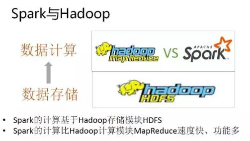

# Spark基本架构及原理
`https://www.cnblogs.com/tgzhu/p/5818374.html`
`https://www.cnblogs.com/ITtangtang/p/7967886.html`

Apache Spark是一个围绕速度、易用性和复杂分析构建的大数据处理框架，最初在2009年由加州大学伯克利分校的AMPLab开发，并于2010年成为Apache的开源项目之一，与Hadoop和Storm等其他大数据和MapReduce技术相比，Spark有如下优势：

* Spark提供了一个全面、统一的框架用于管理各种有着不同性质（文本数据、图表数据等）的数据集和数据源（批量数据或实时的流数据）的大数据处理的需求    
* 官方资料介绍Spark可以将Hadoop集群中的应用在内存中的运行速度提升100倍，甚至能够将应用在磁盘上的运行速度提升10倍

##  Hadoop和Spark
* Hadoop有两个核心模块，分布式存储模块HDFS和分布式计算模块Mapreduce    
* spark本身并没有提供分布式文件系统，因此spark的分析大多依赖于Hadoop的分布式文件系统HDFS    
* Hadoop的Mapreduce与spark都可以进行数据计算，而相比于Mapreduce，spark的速度更快并且提供的功能更加丰富    
* 关系图如下：

## MapReduce和Spark比较
Spark 运算比 Hadoop 的 MapReduce 框架快的原因是因为 Hadoop 在一次 MapReduce 运算之后,会将数据的运算结果从内存写入到磁盘中,第二次 Mapredue 运算时在从磁盘中读取数据,所以其瓶颈在2次运算间的多余 IO 消耗. Spark 则是将数据一直缓存在内存中,直到计算得到最后的结果,再将结果写入到磁盘,所以多次运算的情况下, Spark 是比较快的. 其优化了迭代式工作负载

| Hadoop的局限                                                                                         | Spark的改进                                                                                                                         |
| ---------------------------------------------------------------------------------------------------- | ----------------------------------------------------------------------------------------------------------------------------------- |
| 抽象层次低，代码编写难以上手                                                                         | 通过使用RDD的统一抽象，实现数据处理逻辑的代码非常简洁                                                                               |
| 只提供了Map和Reduce两个操作，欠缺表达力                                                              | 通过RDD提供了很多转换和动作，实现了很多基本操作，如Sort, Join等                                                                     |
| 一个Job只有Map和Reduce两个阶段，复杂的程序需要大量的Job来完成，且Job之间的依赖关系需要开发者自行管理 | 一个Job可以包含RDD的多个转换操作，在调度时可以生成多个阶段（Stage），而且如果多个map操作的RDD的分区不变，是可以放在同一个Task中进行 |
| 处理逻辑隐藏在代码细节中，缺乏整体逻辑视图                                                           | RDD的转换支持流式API,提供处理逻辑的整体视图                                                                                         |
| 对迭代式数据处理性能比较差，Reduce与下一步Map之间的中间结果只能存放在HDFS中                          | 通过内存缓存数据，可大大提高迭代式计算的性能，内存不足时可以溢出到本地磁盘，而不是HDFS                                              |
| ReduceTask需要等待所有MapTask都完成后才可以开始                                                      | 分区相同的转换构成流水线放在一个Task中运行，分区不同的转换需要Shuffle，被划分到不同的Stage中，需要等待前面的Stage完成后才可以开始   |
| 时延高，只适用Batch数据处理，对于交互式数据处理和实时数据处理的支持不够                              | 通过将流拆成小的batch提供Discretized Stream处理流数据                                                                               |

Spark 的主要特点还包括:

* (1)提供 Cache 机制来支持需要反复迭代计算或者多次数据共享,减少数据读取的 IO 开销;    
* (2)提供了一套支持 DAG 图的分布式并行计算的编程框架,减少多次计算之间中间结果写到 Hdfs 的开销;    
* (3)使用多线程池模型减少 Task 启动开稍, shuffle 过程中避免不必要的 sort 操作并减少磁盘 IO 操作。(Hadoop 的 Map 和 reduce 之间的 shuffle 需要 sort)

## 架构及生态
* 通常当需要处理的数据量超过了单机尺度(比如我们的计算机有4GB的内存，而我们需要处理100GB以上的数据)这时我们可以选择spark集群进行计算，有时我们可能需要处理的数据量并不大，但是计算很复杂，需要大量的时间，这时我们也可以选择利用spark集群强大的计算资源，并行化地计算，其架构示意图如下：    

* Spark Core：包含Spark的基本功能；尤其是定义RDD的API、操作以及这两者上的动作。其他Spark的库都是构建在RDD和Spark Core之上的    
* Spark SQL：提供通过Apache Hive的SQL变体Hive查询语言（HiveQL）与Spark进行交互的API。每个数据库表被当做一个RDD，Spark SQL查询被转换为Spark操作。    
* Spark Streaming：对实时数据流进行处理和控制。Spark Streaming允许程序能够像普通RDD一样处理实时数据    
* MLlib：一个常用机器学习算法库，算法被实现为对RDD的Spark操作。这个库包含可扩展的学习算法，比如分类、回归等需要对大量数据集进行迭代的操作。    
* GraphX：控制图、并行图操作和计算的一组算法和工具的集合。GraphX扩展了RDD API，包含控制图、创建子图、访问路径上所有顶点的操作    
* Spark架构的组成图如下：    

* Cluster Manager：在standalone模式中即为Master主节点，控制整个集群，监控worker。在YARN模式中为资源管理器    
* Worker节点：从节点，负责控制计算节点，启动Executor或者Driver。    
* Driver： 运行Application 的main()函数    
* Executor：执行器，是为某个Application运行在worker node上的一个进程

## 运行流程及特点
* 1、spark运行流程图如下：spark运行流程图如下：    

* 2、构建Spark Application的运行环境，启动SparkContext构建Spark Application的运行环境，启动SparkContext    
* 3、SparkContext向资源管理器（可以是Standalone，Mesos，Yarn）申请运行Executor资源，并启动StandaloneExecutorbackend，SparkContext向资源管理器（可以是Standalone，Mesos，Yarn）申请运行Executor资源，并启动StandaloneExecutorbackend，    
* 4、Executor向SparkContext申请TaskExecutor向SparkContext申请Task    
* 5、SparkContext将应用程序分发给ExecutorSparkContext将应用程序分发给Executor    
* 6、SparkContext构建成DAG图，将DAG图分解成Stage、将Taskset发送给Task Scheduler，最后由Task Scheduler将Task发送给Executor运行SparkContext构建成DAG图，将DAG图分解成Stage、将Taskset发送给Task Scheduler，最后由Task Scheduler将Task发送给Executor运行    
* 7、Task在Executor上运行，运行完释放所有资源Task在Executor上运行，运行完释放所有资源

**Spark运行特点：**

* 1、每个Application获取专属的executor进程，该进程在Application期间一直驻留，并以多线程方式运行Task。这种Application隔离机制是有优势的，无论是从调度角度看（每个Driver调度他自己的任务），还是从运行角度看（来自不同Application的Task运行在不同JVM中），当然这样意味着Spark Application不能跨应用程序共享数据，除非将数据写入外部存储系统每个Application获取专属的executor进程，该进程在Application期间一直驻留，并以多线程方式运行Task。这种Application隔离机制是有优势的，无论是从调度角度看（每个Driver调度他自己的任务），还是从运行角度看（来自不同Application的Task运行在不同JVM中），当然这样意味着Spark Application不能跨应用程序共享数据，除非将数据写入外部存储系统    
* 2、Spark与资源管理器无关，只要能够获取executor进程，并能保持相互通信就可以了Spark与资源管理器无关，只要能够获取executor进程，并能保持相互通信就可以了    
* 3、提交SparkContext的Client应该靠近Worker节点（运行Executor的节点），最好是在同一个Rack里，因为Spark Application运行过程中SparkContext和Executor之间有大量的信息交换提交SparkContext的Client应该靠近Worker节点（运行Executor的节点），最好是在同一个Rack里，因为Spark Application运行过程中SparkContext和Executor之间有大量的信息交换    
* 4、Task采用了数据本地性和推测执行的优化机制Task采用了数据本地性和推测执行的优化机制  

## 常用术语
* **Application**: Appliction都是指用户编写的Spark应用程序，其中包括一个Driver功能的代码和分布在集群中多个节点上运行的Executor代码    
* **Driver**:  Spark中的Driver即运行上述Application的main函数并创建SparkContext，创建SparkContext的目的是为了准备Spark应用程序的运行环境，在Spark中有SparkContext负责与ClusterManager通信，进行资源申请、任务的分配和监控等，当Executor部分运行完毕后，Driver同时负责将SparkContext关闭，通常用SparkContext代表Driver    
* **Executor**:  某个Application运行在worker节点上的一个进程，  该进程负责运行某些Task， 并且负责将数据存到内存或磁盘上，每个Application都有各自独立的一批Executor， 在Spark on Yarn模式下，其进程名称为CoarseGrainedExecutor Backend。一个CoarseGrainedExecutor Backend有且仅有一个Executor对象， 负责将Task包装成taskRunner,并从线程池中抽取一个空闲线程运行Task， 这个每一个oarseGrainedExecutor Backend能并行运行Task的数量取决与分配给它的cpu个数    
* **Cluter Manager**：指的是在集群上获取资源的外部服务。目前有三种类型    
    * Standalon : spark原生的资源管理，由Master负责资源的分配    
    * Apache Mesos:与hadoop MR兼容性良好的一种资源调度框架    
    * Hadoop Yarn: 主要是指Yarn中的ResourceManager
* **Worker**: 集群中任何可以运行Application代码的节点，在Standalone模式中指的是通过slave文件配置的Worker节点，在Spark on Yarn模式下就是NoteManager节点    
* **Task**: 被送到某个Executor上的工作单元，但hadoopMR中的MapTask和ReduceTask概念一样，是运行Application的基本单位，多个Task组成一个Stage，而Task的调度和管理等是由TaskScheduler负责    
* **Job**: 包含多个Task组成的并行计算，往往由Spark Action触发生成， 一个Application中往往会产生多个Job    
* **Stage**: 每个Job会被拆分成多组Task， 作为一个TaskSet， 其名称为Stage，Stage的划分和调度是有DAGScheduler来负责的，Stage有非最终的Stage（Shuffle Map Stage）和最终的Stage（Result Stage）两种，Stage的边界就是发生shuffle的地方    
* **DAGScheduler**: 根据Job构建基于Stage的DAG（Directed Acyclic Graph有向无环图)，并提交Stage给TASkScheduler。 其划分Stage的依据是RDD之间的依赖的关系找出开销最小的调度方法，如下图    

* **TASKSedulter**: 将TaskSET提交给worker运行，每个Executor运行什么Task就是在此处分配的. TaskScheduler维护所有TaskSet，当Executor向Driver发生心跳时，TaskScheduler会根据资源剩余情况分配相应的Task。另外TaskScheduler还维护着所有Task的运行标签，重试失败的Task。下图展示了TaskScheduler的作用    

* 在不同运行模式中任务调度器具体为：
    * Spark on Standalone模式为TaskScheduler    
    * YARN-Client模式为YarnClientClusterScheduler    
    * YARN-Cluster模式为YarnClusterScheduler
* 将这些术语串起来的运行层次图如下：   

* Job=多个stage，Stage=多个同种task, Task分为ShuffleMapTask和ResultTask，Dependency分为ShuffleDependency和NarrowDependency

## Spark运行模式
* Spark的运行模式多种多样，灵活多变，部署在单机上时，既可以用本地模式运行，也可以用伪分布模式运行，而当以分布式集群的方式部署时，也有众多的运行模式可供选择，这取决于集群的实际情况，底层的资源调度即可以依赖外部资源调度框架，也可以使用Spark内建的Standalone模式。    
* 对于外部资源调度框架的支持，目前的实现包括相对稳定的Mesos模式，以及hadoop YARN模式    
* 本地模式：常用于本地开发测试，本地还分别 local 和 local cluster  

### standalone
standalone: 独立集群运行模式

* Standalone模式使用Spark自带的资源调度框架    
* 采用Master/Slaves的典型架构，选用ZooKeeper来实现Master的HA    
* 框架结构图如下:    
*     
* 该模式主要的节点有Client节点、Master节点和Worker节点。其中Driver既可以运行在Master节点上中，也可以运行在本地Client端。当用spark-shell交互式工具提交Spark的Job时，Driver在Master节点上运行；当使用spark-submit工具提交Job或者在Eclips、IDEA等开发平台上使用”new SparkConf.setManager(“spark://master:7077”)”方式运行Spark任务时，Driver是运行在本地Client端上的    
* 运行过程如下图：（<em>参考至：http://blog.csdn.net/gamer_gyt/article/details/51833681</em>）    
* 

流程：

* SparkContext连接到Master，向Master注册并申请资源（CPU Core 和Memory）    
* Master根据SparkContext的资源申请要求和Worker心跳周期内报告的信息决定在哪个Worker上分配资源，然后在该Worker上获取资源，然后启动StandaloneExecutorBackend；    
* StandaloneExecutorBackend向SparkContext注册；    
* SparkContext将Applicaiton代码发送给StandaloneExecutorBackend；并且SparkContext解析Applicaiton代码，构建DAG图，并提交给DAG Scheduler分解成Stage（当碰到Action操作时，就会催生Job；每个Job中含有1个或多个Stage，Stage一般在获取外部数据和shuffle之前产生），然后以Stage（或者称为TaskSet）提交给Task Scheduler，Task Scheduler负责将Task分配到相应的Worker，最后提交给StandaloneExecutorBackend执行；    
* StandaloneExecutorBackend会建立Executor线程池，开始执行Task，并向SparkContext报告，直至Task完成    
* 所有Task完成后，SparkContext向Master注销，释放资源

### YARN-Client
（参考：http://blog.csdn.net/gamer_gyt/article/details/51833681）

* Spark on YARN模式根据Driver在集群中的位置分为两种模式：一种是YARN-Client模式，另一种是YARN-Cluster（或称为YARN-Standalone模式）    
* Yarn-Client模式中，Driver在客户端本地运行，这种模式可以使得Spark Application和客户端进行交互，因为Driver在客户端，所以可以通过webUI访问Driver的状态，默认是http://hadoop1:4040访问，而YARN通过http:// hadoop1:8088访问    
* YARN-client的工作流程步骤为：    
*     
* Spark Yarn Client向YARN的ResourceManager申请启动Application Master。同时在SparkContent初始化中将创建DAGScheduler和TASKScheduler等，由于我们选择的是Yarn-Client模式，程序会选择YarnClientClusterScheduler和YarnClientSchedulerBackend    
* ResourceManager收到请求后，在集群中选择一个NodeManager，为该应用程序分配第一个Container，要求它在这个Container中启动应用程序的ApplicationMaster，与YARN-Cluster区别的是在该ApplicationMaster不运行SparkContext，只与SparkContext进行联系进行资源的分派    
* Client中的SparkContext初始化完毕后，与ApplicationMaster建立通讯，向ResourceManager注册，根据任务信息向ResourceManager申请资源（Container）    
* 一旦ApplicationMaster申请到资源（也就是Container）后，便与对应的NodeManager通信，要求它在获得的Container中启动CoarseGrainedExecutorBackend，CoarseGrainedExecutorBackend启动后会向Client中的SparkContext注册并申请Task    
* client中的SparkContext分配Task给CoarseGrainedExecutorBackend执行，CoarseGrainedExecutorBackend运行Task并向Driver汇报运行的状态和进度，以让Client随时掌握各个任务的运行状态，从而可以在任务失败时重新启动任务    
* 应用程序运行完成后，Client的SparkContext向ResourceManager申请注销并关闭自己

### YARN-Cluster
在YARN-Cluster模式中，当用户向YARN中提交一个应用程序后，YARN将分两个阶段运行该应用程序：

* 第一个阶段是把Spark的Driver作为一个ApplicationMaster在YARN集群中先启动；    
* 第二个阶段是由ApplicationMaster创建应用程序，然后为它向ResourceManager申请资源，并启动Executor来运行Task，同时监控它的整个运行过程，直到运行完成  

**YARN-cluster的工作流程分为以下几个步骤**

*     
* Spark Yarn Client向YARN中提交应用程序，包括ApplicationMaster程序、启动ApplicationMaster的命令、需要在Executor中运行的程序等    
* ResourceManager收到请求后，在集群中选择一个NodeManager，为该应用程序分配第一个Container，要求它在这个Container中启动应用程序的ApplicationMaster，其中ApplicationMaster进行SparkContext等的初始化    
* ApplicationMaster向ResourceManager注册，这样用户可以直接通过ResourceManage查看应用程序的运行状态，然后它将采用轮询的方式通过RPC协议为各个任务申请资源，并监控它们的运行状态直到运行结束    
* 一旦ApplicationMaster申请到资源（也就是Container）后，便与对应的NodeManager通信，要求它在获得的Container中启动CoarseGrainedExecutorBackend，CoarseGrainedExecutorBackend启动后会向ApplicationMaster中的SparkContext注册并申请Task。这一点和Standalone模式一样，只不过SparkContext在Spark Application中初始化时，使用CoarseGrainedSchedulerBackend配合YarnClusterScheduler进行任务的调度，其中YarnClusterScheduler只是对TaskSchedulerImpl的一个简单包装，增加了对Executor的等待逻辑等    
* ApplicationMaster中的SparkContext分配Task给CoarseGrainedExecutorBackend执行，CoarseGrainedExecutorBackend运行Task并向ApplicationMaster汇报运行的状态和进度，以让ApplicationMaster随时掌握各个任务的运行状态，从而可以在任务失败时重新启动任务    
* 应用程序运行完成后，ApplicationMaster向ResourceManager申请注销并关闭自己

### Spark Client 和 Spark Cluster的区别
Spark Client 和 Spark Cluster的区别:

* 理解YARN-Client和YARN-Cluster深层次的区别之前先清楚一个概念：Application Master。在YARN中，每个Application实例都有一个ApplicationMaster进程，它是Application启动的第一个容器。它负责和ResourceManager打交道并请求资源，获取资源之后告诉NodeManager为其启动Container。从深层次的含义讲YARN-Cluster和YARN-Client模式的区别其实就是ApplicationMaster进程的区别    
* YARN-Cluster模式下，Driver运行在AM(Application Master)中，它负责向YARN申请资源，并监督作业的运行状况。当用户提交了作业之后，就可以关掉Client，作业会继续在YARN上运行，因而YARN-Cluster模式不适合运行交互类型的作业   
* YARN-Client模式下，Application Master仅仅向YARN请求Executor，Client会和请求的Container通信来调度他们工作，也就是说Client不能离开

## RDD运行流程
* RDD在Spark中运行大概分为以下三步：    
    * 创建RDD对象    
    * DAGScheduler模块介入运算，计算RDD之间的依赖关系，RDD之间的依赖关系就形成了DAG    
    * 每一个Job被分为多个Stage。划分Stage的一个主要依据是当前计算因子的输入是否是确定的，如果是则将其分在同一个Stage，避免多个Stage之间的消息传递开销  
* 示例图如下：    

* 以下面一个按 A-Z 首字母分类，查找相同首字母下不同姓名总个数的例子来看一下 RDD 是如何运行起来的    

* 创建 RDD  上面的例子除去最后一个 collect 是个动作，不会创建 RDD 之外，前面四个转换都会创建出新的 RDD 。    
* 创建执行计划 Spark 会尽可能地管道化，并基于是否要重新组织数据来划分 阶段 (stage) ，例如本例中的 groupBy() 转换就会将整个执行计划划分成两阶段执行。最终会产生一个 DAG(directed acyclic graph ，有向无环图 ) 作为逻辑执行计划   
 
* 调度任务  将各阶段划分成不同的 任务 (task) ，每个任务都是数据和计算的合体。在进行下一阶段前，当前阶段的所有任务都要执行完成。因为下一阶段的第一个转换一定是重新组织数据的，所以必须等当前阶段所有结果数据都计算出来了才能继续

## Spark作业基本运行原理

详细原理见上图。

我们使用spark-submit提交一个Spark作业之后，这个作业就会启动一个对应的Driver进程。根据你使用的部署模式（deploy-mode）不同，Driver进程可能在本地启动，也可能在集群中某个工作节点上启动。Driver进程本身会根据我们设置的参数，占有一定数量的内存和CPU core。而Driver进程要做的第一件事情，就是向集群管理器(YARN或者其他资源管理集群）申请运行Spark作业需要使用的资源，这里的资源指的就是Executor进程。YARN集群管理器会根据我们为Spark作业设置的资源参数，在各个工作节点上，启动一定数量的Executor进程，每个Executor进程都占有一定数量的内存和CPU core。

在申请到了作业执行所需的资源之后，Driver进程就会开始调度和执行我们编写的作业代码了。Driver进程会将我们编写的Spark作业代码分拆为多个stage，每个stage执行一部分代码片段，并为每个stage创建一批task，然后将这些task分配到各个Executor进程中执行。task是最小的计算单元，负责执行一模一样的计算逻辑（也就是我们自己编写的某个代码片段），只是每个task处理的数据不同而已。一个stage的所有task都执行完毕之后，会在各个节点本地的磁盘文件中写入计算中间结果，然后Driver就会调度运行下一个stage。下一个stage的task的输入数据就是上一个stage输出的中间结果。如此循环往复，直到将我们自己编写的代码逻辑全部执行完，并且计算完所有的数据，得到我们想要的结果为止。

Spark是根据shuffle类算子来进行stage的划分。如果我们的代码中执行了某个shuffle类算子（比如reduceByKey、join等），那么就会在该算子处，划分出一个stage界限来。可以大致理解为，shuffle算子执行之前的代码会被划分为一个stage，shuffle算子执行以及之后的代码会被划分为下一个stage。因此一个stage刚开始执行的时候，它的每个task可能都会从上一个stage的task所在的节点，去通过网络传输拉取需要自己处理的所有key，然后对拉取到的所有相同的key使用我们自己编写的算子函数执行聚合操作（比如reduceByKey()算子接收的函数）。这个过程就是shuffle。

当我们在代码中执行了cache/persist等持久化操作时，根据我们选择的持久化级别的不同，每个task计算出来的数据也会保存到Executor进程的内存或者所在节点的磁盘文件中。

因此Executor的内存主要分为三块：第一块是让task执行我们自己编写的代码时使用，默认是占Executor总内存的20%；第二块是让task通过shuffle过程拉取了上一个stage的task的输出后，进行聚合等操作时使用，默认也是占Executor总内存的20%；第三块是让RDD持久化时使用，默认占Executor总内存的60%。

task的执行速度是跟每个Executor进程的CPU core数量有直接关系的。一个CPU core同一时间只能执行一个线程。而每个Executor进程上分配到的多个task，都是以每个task一条线程的方式，多线程并发运行的。如果CPU core数量比较充足，而且分配到的task数量比较合理，那么通常来说，可以比较快速和高效地执行完这些task线程。

以上就是Spark作业的基本运行原理的说明

