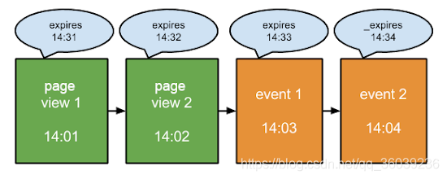

# 数仓面试|四个在工作后才知道的SQL密技
摘抄自：`https://www.cnblogs.com/jmx-bigdata/articles/13451208.html`

SQL是大数据从业者的必备技能，大部分的大数据技术框架也都提供了SQL的解决方案。可以说SQL是一种经久不衰、历久弥新的编程语言。尤其是在数仓领域，使用SQL更是家常便饭。本文会分享四个在面试和工作中常用的几个使用技巧，具体包括：


* 日期与期间的使用    
* 临时表与Common Table Expression (WITH)    
* Aggregation 与CASE WHEN的结合使用    
* Window Function的其他用途


数仓？不就是写写SQL吗… !


## 第一：日期与期间的使用


日期与时间段的筛选在工作中是经常被用到的，因为在拉取报表、仪表板和各种分析时，周、月、季度、年度的表现往往是分析需要考量的重点。


### 时间区段的提取：Extract


* 语法

```sql
-- field可以是day、hour、minute, month, quarter等等
-- source可以是date、timestamp类型
extract(field FROM source)

```

* 使用

```sql
SELECT extract(year FROM '2020-08-05 09:30:08');   -- 结果为 2020
SELECT extract(quarter FROM '2020-08-05 09:30:08');   -- 结果为 3
SELECT extract(month FROM '2020-08-05 09:30:08');   -- 结果为 8
SELECT extract(week FROM '2020-08-05 09:30:08');   -- 结果为 31,一年中的第几周
SELECT extract(day FROM '2020-08-05 09:30:08');  -- 结果为 5
SELECT extract(hour FROM '2020-08-05 09:30:08');   -- 结果为 9
SELECT extract(minute FROM '2020-08-05 09:30:08');   -- 结果为 30
SELECT extract(second FROM '2020-08-05 09:30:08');   -- 结果为 8

```

上面可供提取的字段，不同的数据库存在些许的差异。以Hive为例，支持`day, dayofweek, hour, minute, month, quarter, second, week 和 year`。其中周、月、年使用最为广泛，因为无论是公司内部产品，还是商用的产品所提供的数据后台统计，周报和月报(比如近7天、近30天)最注重表现的周期。


注意：


impala支持：YEAR, QUARTER, MONTH, DAY, HOUR, MINUTE, SECOND, MILLISECOND, EPOCH


Hive支持：day, dayofweek, hour, minute, month, quarter, second, week 和 year


Hive是从**Hive2.2.0**版本开始引入该函数


### 周的提取


* 语法


在按照周的区间进行统计时，需要识别出周一的日期与周日的日期，这个时候经常会用到下面的函数：

```sql
next_day(STRING start_date, STRING day_of_week)
-- 返回当前日期对应的下一个周几对应的日期
-- 2020-08-05为周三
SELECT next_day('2020-08-05','MO') -- 下一个周一对应的日期：2020-08-10
SELECT next_day('2020-08-05','TU') -- 下一个周二对应的日期：2020-08-11
SELECT next_day('2020-08-05','WE') -- 下一个周三对应的日期：2020-08-12
SELECT next_day('2020-08-05','TH') -- 下一个周四对应的日期：2020-08-06，即为本周四
SELECT next_day('2020-08-05','FR') -- 下一个周五对应的日期：2020-08-07，即为本周五
SELECT next_day('2020-08-05','SA') -- 下一个周六对应的日期：2020-08-08，即为本周六
SELECT next_day('2020-08-05','SU') -- 下一个周日对应的日期：2020-08-09，即为本周日
-- 星期一到星期日的英文（Monday，Tuesday、Wednesday、Thursday、Friday、Saturday、Sunday）

```

* 使用


那么该如何获取当前日期所在周的周一对应的日期呢？只需要先获取当前日期的下周一对应的日期，然后减去7天，即可获得：

```sql
SELECT date_add(next_day('2020-08-05','MO'),-7);

```

同理，获取当前日期所在周的周日对应的日期，只需要先获取当前日期的下周一对应的日期，然后减去1天，即可获得：

```sql
select date_add(next_day('2020-08-05','MO'),-1)
-- 2020-08-09

```

### 月的提取


* 语法


至于怎么将月份从单一日期提取出来呢，LAST_DAY这个函数可以将每个月中的日期变成该月的最后一天(28号，29号，30号或31号)，如下：

```sql
last_day(STRING date)

```

* 使用

```sql
SELECT last_day('2020-08-05'); -- 2020-08-31

```

除了上面的方式，也可以使用date_format函数，比如：

```sql
SELECT date_format('2020-08-05','yyyy-MM');
-- 2020-08

```

### 日期的范围


月的Window：使用add_months加上trunc()的应用

```sql
-- 返回加减月份之后对应的日期
-- 2020-07-05
select add_months('2020-08-05', -1)

-- 返回当前日期的月初日期
-- 2020-08-01
select trunc("2020-08-05",'MM')


```

由上面范例可见，单纯使用add_months，减N个月的用法，可以刚好取到整数月的数据，但如果加上trunc()函数，则会从前N个月的一号开始取值。

```sql
-- 选取2020-07-05到2020-08-05所有数据
BETWEEN add_months('2020-08-05', -1) AND '2020-08-05'
-- 选取2020-07-01到2020-08-05之间所有数据
BETWEEN add_months(trunc("2020-08-05",'MM'),-1) AND '2020-08-05'


```

## 第二：临时表与Common Table Expression (WITH)


这两种方法是日常工作中经常被使用到，对于一些比较复杂的计算任务，为了避免过多的JOIN，通常会先把一些需要提取的部分数据使用临时表或是CTE的形式在主要查询区块前进行提取。


**临时表的作法：**

```sql
CREATE TEMPORARY TABLE table_1 AS
    SELECT
        columns
    FROM table A;
CREATE TEMPORARY table_2 AS
    SELECT
        columns
    FROM table B;

SELECT
    table_1.columns,
    table_2.columns,
    c.columns
FROM table C JOIN table_1
     JOIN table_2;


```

**CTE的作法：**

```sql
-- 注意Hive、Impala支持这种语法，低版本的MySQL不支持(高版本支持)
WITH employee_by_title_count AS (
    SELECT
        t.name as job_title
        , COUNT(e.id) as amount_of_employees
    FROM employees e
        JOIN job_titles t on e.job_title_id = t.id
    GROUP BY 1
),
salaries_by_title AS (
     SELECT
         name as job_title
         , salary
     FROM job_titles
)
SELECT *
FROM employee_by_title_count e
    JOIN salaries_by_title s ON s.job_title = e.job_title


```

可以看到TEMP TABLE和CTE WITH的用法其实非常类似，目的都是为了让你的Query更加一目了然且优雅简洁。很多人习惯将所有的Query写在单一的区块里面，用过多的JOIN或SUBQUERY，导致最后逻辑丢失且自己也搞不清楚写到哪里，适时的使用TEMP TABLE和CTE作为辅助，绝对是很加分的。


## 第三：Aggregation 与CASE WHEN的结合使用


将Aggregation function (SUM/COUNT/COUNT DISTINCT/MIN/MAX) 结合CASE WHEN是最强大且最有趣的使用方式。这样的使用创造出一种类似EXCEL中SUMIF/COUNTIF的效果，可以用这个方式做出很多高效的分析。


* Table Name: order    
* Column: register_date, order_date, user_id, country, order_sales, order_id


### 数据准备

```sql
CREATE TABLE order(
    register_date string,
    order_date string,
    user_id string,
    country string,
    order_sales decimal(10,2),
    order_id string);

INSERT INTO TABLE order VALUES("2020-06-07","2020-06-09","001",'c0',210,"o1");
INSERT INTO TABLE order VALUES("2020-06-08","2020-06-09","002",'c1',220,"o2");
INSERT INTO TABLE order VALUES("2020-06-07","2020-06-10","003",'c2',230,"o3");
INSERT INTO TABLE order VALUES("2020-06-09","2020-06-10","004",'c3',200,"o4");
INSERT INTO TABLE order VALUES("2020-06-07","2020-06-20","005",'c4',300,"o5");
INSERT INTO TABLE order VALUES("2020-06-10","2020-06-23","006",'c5',400,"o6");
INSERT INTO TABLE order VALUES("2020-06-07","2020-06-19","007",'c6',600,"o7");
INSERT INTO TABLE order VALUES("2020-06-12","2020-06-18","008",'c7',700,"o8");
INSERT INTO TABLE order VALUES("2020-06-07","2020-06-09","009",'c8',100,"o9");
INSERT INTO TABLE order VALUES("2020-06-15","2020-06-18","0010",'c9',200,"o10");
INSERT INTO TABLE order VALUES("2020-06-15","2020-06-19","0011",'c10',250,"o11");
INSERT INTO TABLE order VALUES("2020-06-12","2020-06-29","0012",'c11',270,"o12");
INSERT INTO TABLE order VALUES("2020-06-16","2020-06-19","0013",'c12',230,"o13");
INSERT INTO TABLE order VALUES("2020-06-17","2020-06-20","0014",'c13',290,"o14");
INSERT INTO TABLE order VALUES("2020-06-20","2020-06-29","0015",'c14',203,"o15");


```

### CASE WHEN 时间，进行留存率/使用率的分析

```sql
-- 允许多列去重
set hive.groupby.skewindata = false
-- 允许使用位置编号分组或排序
set hive.groupby.orderby.position.alias = true

SELECT
    date_add(Next_day(register_date, 'MO'),-1) AS week_end,
    COUNT(DISTINCT CASE WHEN order_date BETWEEN register_date AND date_add(register_date,6) THEN user_id END) AS first_week_order,
    COUNT(DISTINCT CASE WHEN order_date BETWEEN date_add(register_date ,7) AND date_add(register_date,13) THEN user_id END) AS sencod_week_order,
    COUNT(DISTINCT CASE WHEN order_date BETWEEN date_add(register_date ,14) AND date_add(register_date,20) THEN user_id END) as third_week_order
FROM order
GROUP BY 1


```

上面的示例可以得知到用户在注册之后，有没有创建订单的行为。比如注册后的第一周，第二周，第三周分别有多少下单用户，这样可以分析出用户的使用情况和留存情况。


注意：上面的使用方式，需要配置两个参数：


**hive.groupby.skewindata = false**：允许多列去重，否则报错：


`SemanticException [Error 10022]: DISTINCT on different columns not supported with skew in data`


**hive.groupby.orderby.position.alias = true**：允许使用位置编号分组或排序,否则报错：


`SemanticException [Error 10025]: line 79:13 Expression not in GROUP BY key ''MO''`


### CASE WHEN 时间，进行每个用户消费金额的分析

```sql
SELECT
    user_id,
    SUM (CASE WHEN order_date BETWEEN register_date AND date_add(register_date,6) THEN order_sales END) AS first_week_amount,
    SUM (CASE WHEN order_date BETWEEN date_add(register_date ,7) AND date_add(register_date,13) THEN order_sales END) AS second_week_amount
    FROM order
GROUP BY 1


```

通过筛选出注册与消费的日期，并且进行消费金额统计，每个用户在每段时间段(注册后第一周、第二周…以此类推)的消费金额，可以观察用户是否有持续维持消费习惯或是消费金额变低等分析。


### CASE WHEN数量，消费金额超过某一定额的数量分析

```sql
SELECT
    user_id,
    COUNT(DISTINCT CASE WHEN order_sales >= 100 THEN order_id END) AS count_of_order_greateer_than_100
FROM order
GROUP BY 1


```

上面的示例就是类似countif的用法，针对每个用户，统计其订单金额大于某个值的订单数量，分析去筛选出高价值的顾客。


### CASE WHEN数量，加上时间的用法

```sql
SELECT
    user_id,
    MIN(CASE WHEN order_sales > 100 THEN order_date END) AS first_order_date_over1000,
    MAX(CASE WHEN order_sales > 100 THEN order_date END) AS recent_order_date_over100
FROM order
GROUP BY 1


```

CASE WHEN加上MIN/MAX时间，可以得出该用户在其整个使用过程中，首次购买超过一定金额的订单日期，以及最近一次购买超过一定金额的订单日期。


## 第四：Window Function的其他用途


Window Function既是工作中经常使用的函数，也是面试时经常被问到的问题。常见的使用场景是分组取topN。本文介绍的另外一个用法，使用开窗函数进行用户访问session分析。


session是指在指定的时间段内用户在网站上发生的一系列互动。例如，一次session可以包含多个网页浏览、事件、社交互动和电子商务交易。session就相当于一个容器，其中包含了用户在网站上执行的操作。


session具有一个过期时间，比如30分钟，即不活动状态超过 30 分钟，该session就会过时。


假设张三访问了网站，从他到达网站的那一刻开始，就开始计时。如果过了 30 分钟，而张三仍然没有进行任何形式的互动，则视为本次session结束。但是，只要张三与某个元素进行了互动（例如发生了某个事件、社交互动或打开了新网页），就会在该次互动的时间基础上再增加 30 分钟，从而重置过期时间。




### 数据准备


* Table Name: user_visit_action    
* Columns: user_id, session_id , page_url, action_time

```sql
CREATE TABLE user_visit_action(
    user_id string,
    session_id string,
    page_url string,
    action_time string);

INSERT INTO TABLE user_visit_action VALUES("001","ss001","http://a.com","2020-08-06 13:34:11.478");
INSERT INTO TABLE user_visit_action VALUES("001","ss001","http://b.com","2020-08-06 13:35:11.478");
INSERT INTO TABLE user_visit_action VALUES("001","ss001","http://c.com","2020-08-06 13:36:11.478");

INSERT INTO TABLE user_visit_action VALUES("001","ss002","http://a.com","2020-08-06 14:30:11.478");
INSERT INTO TABLE user_visit_action VALUES("001","ss002","http://b.com","2020-08-06 14:31:11.478");
INSERT INTO TABLE user_visit_action VALUES("001","ss002","http://e.com","2020-08-06 14:33:11.478");
INSERT INTO TABLE user_visit_action VALUES("001","ss002","http://f.com","2020-08-06 14:35:11.478");

INSERT INTO TABLE user_visit_action VALUES("002","ss003","http://u.com","2020-08-06 18:34:11.478");
INSERT INTO TABLE user_visit_action VALUES("002","ss003","http://k.com","2020-08-06 18:38:11.478");


```

### 用户访问session分析


范例的资料表如上，有使用者、访次和页面的连结和时间。以下则使用partition by来表达每个使用者在不同访次之间的浏览行为。

```sql
SELECT
    user_id,
    session_id,
    page_url,
    DENSE_RANK() OVER (PARTITION BY user_id, session_id ORDER BY action_time ASC) AS page_order,
    MIN(action_time) OVER (PARTITION BY user_id, session_id) AS session_start_time,
    MAX(action_time) OVER (PARTITION BY user_id, session_id) AS session_finisht_time
FROM user_visit_action


```

上面的查询会返回针对每个用户、每次的到访，浏览页面行为的先后次序，以及该session开始与结束的时间，以此为基础就可以将这个结果存入TEMP TABLE或是CTE ，进行更进一步的分析。


## 小结


本文主要分享了四个在工作和面试中经常遇到的SQL使用技巧。当然，这些都与具体的分析业务息息相关。最后，不管你是SQL boy  or  SQL girl，只要是掌握一些技巧，相信都能够Happy SQL querying 😊。


公众号『大数据技术与数仓』


