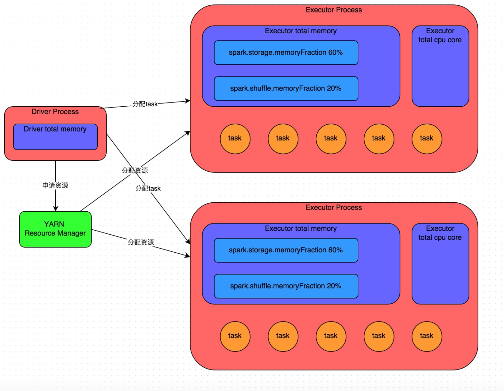
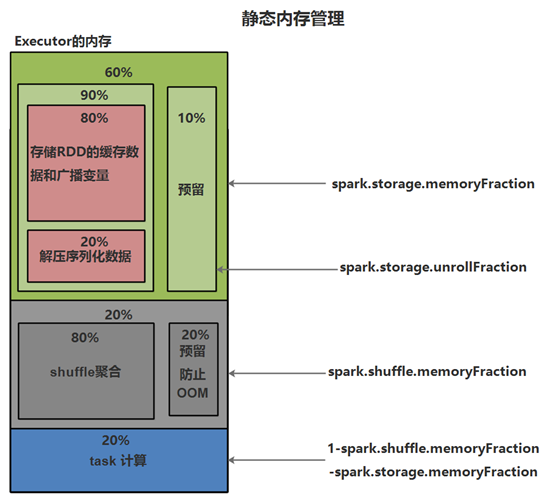
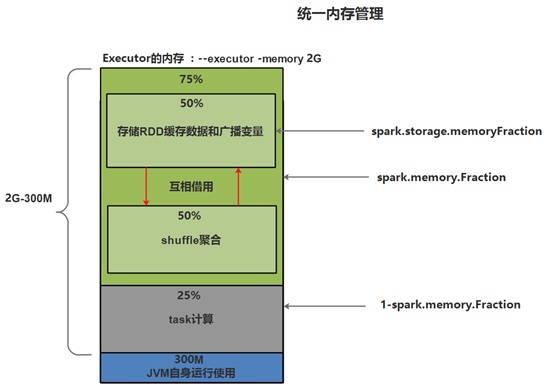

[toc]

# Spark性能调优01-资源调优
摘抄自：`https://cloud.tencent.com/developer/article/1336628`

## 1. 概述

在开发完Spark作业之后，就该为作业配置合适的资源了。
 Spark的资源参数，基本都可以在spark-submit命令中作为参数设置。

资源参数设置的不合理，可能会导致没有充分利用集群资源，作业运行会极其缓慢；或者设置的资源过大，队列没有足够的资源来提供，进而导致各种异常。总之，无论是哪种情况，都会导致Spark作业的运行效率低下，甚至根本无法运行。

因此我们必须对Spark作业的资源使用原理有一个清晰的认识，并知道在Spark作业运行过程中，有哪些资源参数是可以设置的，以及如何设置合适的参数值

## 2. Spark作业基本运行原理



原理见上图。
 我们使用spark-submit提交一个Spark作业之后，这个作业就会启动一个对应的Driver进程。根据你使用的部署模式（deploy-mode）不同，Driver进程可能在本地启动，也可能在集群中某个工作节点上启动。Driver进程本身会根据我们设置的参数，占有一定数量的内存和CPU core。而Driver进程要做的第一件事情，就是向集群管理器（可以是Spark Standalone集群，也可以是Yarn资源管理集群）申请运行Spark作业需要使用的资源，这里的资源指的就是Executor进程。集群管理器会根据我们为Spark作业设置的资源参数，在各个工作节点上，启动一定数量的Executor进程，每个Executor进程都占有一定数量的内存和CPU core。

在申请到了作业执行所需的资源之后，Driver进程就会开始调度和执行我们编写的作业代码了。Driver进程会将我们编写的Spark作业代码分拆为多个stage，每个stage执行一部分代码片段，并为每个stage创建一批task，然后将这些task分配到各个Executor进程中执行。task是最小的计算单元，负责执行一模一样的计算逻辑（也就是我们自己编写的某个代码片段），只是每个task处理的数据不同而已。一个stage的所有task都执行完毕之后，会在各个节点本地的磁盘文件中写入计算中间结果，然后Driver就会调度运行下一个stage。下一个stage的task的输入数据就是上一个stage输出的中间结果。如此循环往复，直到将我们自己编写的代码逻辑全部执行完，并且计算完所有的数据，得到我们想要的结果为止。

Spark是根据shuffle类算子来进行stage的划分。如果我们的代码中执行了某个shuffle类算子（比如reduceByKey、join等），那么就会在该算子处，划分出一个stage界限来。可以大致理解为，shuffle算子执行之前的代码会被划分为一个stage，shuffle算子执行以及之后的代码会被划分为下一个stage。因此一个stage刚开始执行的时候，它的每个task可能都会从上一个stage的task所在的节点，去通过网络传输拉取需要自己处理的所有key，然后对拉取到的所有相同的key使用我们自己编写的算子函数执行聚合操作（比如reduceByKey()算子接收的函数）。
 这个过程就是shuffle。

当我们在代码中执行了cache/persist等持久化操作时，根据我们选择的持久化级别的不同，每个task计算出来的数据也会保存到Executor进程的内存或者所在节点的磁盘文件中。

因此Executor的内存主要分为三块：第一块是让task执行我们自己编写的代码时使用，默认是占Executor总内存的20%；第二块是让task通过shuffle过程拉取了上一个stage的task的输出后，进行聚合等操作时使用，默认也是占Executor总内存的20%；第三块是让RDD持久化时使用，默认占Executor总内存的60%。task的执行速度是跟每个Executor进程的CPU core数量有直接关系的。一个CPU core同一时间只能执行一个线程。而每个Executor进程上分配到的多个task，都是以每个task一条线程的方式，多线程并发运行的。如果CPU core数量比较充足，而且分配到的task数量比较合理，那么通常来说，可以比较快速和高效地执行完这些task线程。

以上就是Spark作业的基本运行原理的说明，可以结合上图来理解。理解作业基本原理，是我们进行资源参数调优的基本前提。

## 3. spark内存管理

### (1) spark-1.5.x版本以前使用静态内存管理



### (2) 从spark-1.5.x版本以后使用同一内存管理



版本不同，这些配置对应的比例可能会有所不同

## 4. 资源调优

### (1) 搭建集群的时候分配够资源

在spark-env.sh配置文件中，指定整个集群的资源

```sh
SPARK_WORKER_CORES, to set the number of cores to use on this machine, default: 1
SPARK_WORKER_MEMORY, to set how much total memory workers have to give executors (e.g. 1000m, 2g), default: 1g
SPARK_WORKER_INSTANCES, to set the number of worker processes per node, default: 1
```

### (2) 提交任务时合理分配资源

#### --total-executor-cores

* 参数说明：
 该参数用于设置Spark作业总共可以使用多少个core    
* 参数调优建议：
 不要超过队列总CPU core的1/3~1/2左右比较合适

#### --num-executors

* 参数说明：
 该参数用于设置Spark作业总共要用多少个Executor进程来执行。Driver在向YARN集群管理器申请资源时，YARN集群管理器会尽可能按照你的设置来在集群的各个工作节点上，启动相应数量的Executor进程。这个参数非常之重要，如果不设置的话，默认只会给你启动少量的Executor进程，此时你的Spark作业的运行速度是非常慢的。    
* 参数调优建议：
 每个Spark作业的运行一般设置50~100个左右的Executor进程比较合适，设置太少或太多的Executor进程都不好。设置的太少，无法充分利用集群资源；设置的太多的话，大部分队列可能无法给予充分的资源。

#### --executor-memory

* 参数说明：
 该参数用于设置每个Executor进程的内存。Executor内存的大小，很多时候直接决定了Spark作业的性能，而且跟常见的JVM OOM异常，也有直接的关联。    
* 参数调优建议：
 每个Executor进程的内存设置4G~8G较为合适。但是这只是一个参考值，具体的设置还是得根据不同部门的资源队列来定。可以看看自己团队的资源队列的最大内存限制是多少，num-executors乘以executor-memory，是不能超过队列的最大内存量的。
 此外，如果你是跟团队里其他人共享这个资源队列，那么申请的内存量最好不要超过资源队列最大总内存的1/3~1/2，避免你自己的Spark作业占用了队列所有的资源，导致别的同事的作业无法运行。

#### --executor-cores

* 参数说明：
 该参数用于设置每个Executor进程的CPU core数量。这个参数决定了每个Executor进程并行执行task线程的能力。因为每个CPU core同一时间只能执行一个task线程，因此每个Executor进程的CPU core数量越多，越能够快速地执行完分配给自己的所有task线程。    
* 参数调优建议：
 Executor的CPU core数量设置为2~4个较为合适。同样得根据不同部门的资源队列来定，可以看看自己的资源队列的最大CPU core限制是多少，再依据设置的Executor数量，来决定每个Executor进程可以分配到几个CPU core。同样建议，如果是跟他人共享这个队列，那么num-executors * executor-cores不要超过队列总CPU core的1/3~1/2左右比较合适，也是避免影响其他同事的作业运行。

#### --driver-memory

* 参数说明：
 该参数用于设置Driver进程的内存。    
* 参数调优建议：
 Driver的内存通常来说不设置，或者设置1G左右应该就够了。
 唯一需要注意的一点是，如果需要使用collect算子将RDD的数据全部拉取到Driver上进行处理，那么必须确保Driver的内存足够大，否则会出现OOM内存溢出的问题。

#### --driver-cores

* 参数说明：
 Cores for driver (Default: 1)    
* 参数调优建议：
 因为Driver端不会执行task，所以保持默认即可

### (3) 提交的任务要充分使用资源

**充分使用资源就是要提高任务的并行度,提高并行度就是要给RDD设置更多的分区**,有以下几种办法，可以改变RDD的分区数

#### <1> 降低HDFS的block块的大小

因为Spark用的读取文件的方法是MR的方法，所以读取文件的时候，首先划分成一个一个的split。RDD的partition数=split数，而在默认情况下，split数=block数，所以partition数=block数，所以降低block块的大小可以增加block块的个数，从而增加partition的个数，从而提供并行度

#### <2> sparkContext.textFile(path, numPartitions)

在读取文件的时候可以指定分区数

#### <3> coalesce(numPartitions, isshuffle)

改变RDD分区数，一般设置第二个参数为false，用于减少分区

#### <4> repartition(numPartitions)

改变RDD分区数，一般用于增加分区数

#### <5> reduceByKey、groupByKey这些算子都可以指定分区数，决定返回的RDD的分区个数

`val rdd2 = rdd1.reduceByKey(_+_)`默认情况下：RDD2的分区数和RDD1的分区数是一致的
 可以修改分区数：`val rdd2 = rdd1.reduceByKey(_+_, numPartitions)`

#### <6> spark.default.parallelism

* 参数说明：
 该参数用于设置每个stage的默认task数量。**这个参数极为重要**，如果不设置可能会直接影响你的Spark作业性能。    
* 参数调优建议：
 Spark作业的默认task数量为500~1000个较为合适。
 很多人常犯的一个错误就是不去设置这个参数，那么此时就会导致Spark自己根据底层HDFS的block数量来设置task的数量，默认是一个HDFS block对应一个task。
 通常来说，Spark默认设置的数量是偏少的（比如就几十个task），如果task数量偏少的话，就会导致你前面设置好的Executor的参数都前功尽弃。
 试想一下，无论你的Executor进程有多少个，内存和CPU有多大，但是task只有1个或者10个，那么90%的Executor进程可能根本就没有task执行，也就是白白浪费了资源！
 因此Spark官网建议的设置原则是，设置该参数为num-executors * executor-cores的2~3倍较为合适，比如Executor的总CPU core数量为300个，那么设置1000个task是可以的，此时可以充分地利用Spark集群的资源。

#### <7> spark.sql.shuffle.partitions

* 参数说明：
 spark sql编程中产生shuffle，决定shuffle过程中reduce task的个数
 default：200    
* 参数调优建议：
 同 spark.default.parallelism

#### <8> partitionBy(Partitioner)

通过自定义分区器来改变partition个数

#### <9> join算子也会改变RDD分区数

`val rdd3 = rdd1.join(rdd2)`默认情况下(spark.default.parallelism没有设置)时，RDD3的分区数是由父RDD中分区数最多的RDD决定的，比如rdd1有2个分区，rdd2有3个分区，那么rdd3有3个分区

#### <10> sparkContext.parallelize(List, numPartitions)、sparkContext.makeRDD(List, numPartitions)

以上生成RDD的方法主要用于测试代码中，也可以指定分区数

## 4. 设置调优参数的3种方法

配置这些参数有两种方式

### (1) 在程序中硬编码

例如`sparkConf.set("spark.default.parallelism","100")`

### (2) 提交application时在命令行指定

```xml
./bin/spark-submit \
  --master yarn-cluster \
  --num-executors 100 \
  --executor-memory 6G \
  --executor-cores 4 \
  --driver-memory 1G \
  --conf spark.default.parallelism=1000 \
  --conf spark.storage.memoryFraction=0.5 \
  --conf spark.shuffle.memoryFraction=0.3 \
  --conf spark.shuffle.file.buffer=64k
```

### (3) 修改SPARK_HOME/conf/spark-default.conf配置文件

推荐使用第2种方式

参考文章：[Spark性能优化指南——基础篇](https://link.jianshu.com/?t=https://tech.meituan.com/spark-tuning-basic.html "Spark性能优化指南——基础篇")


