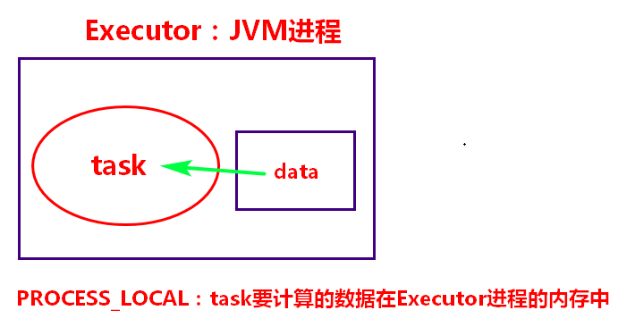
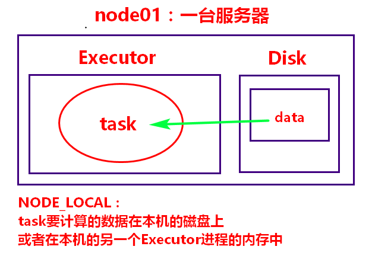
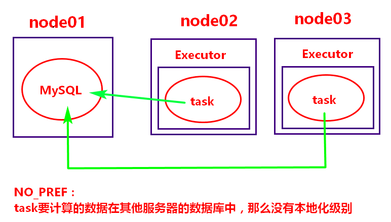
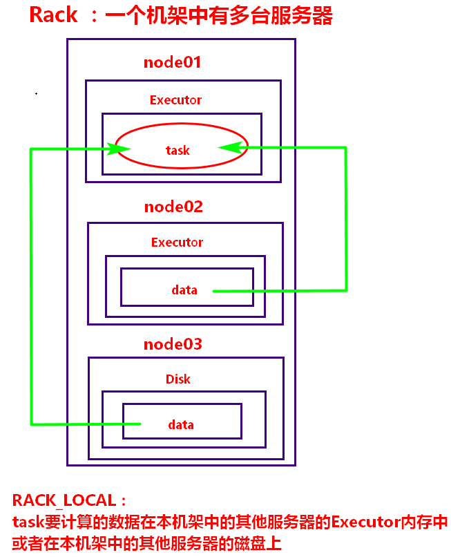
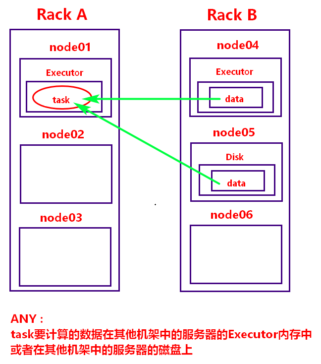
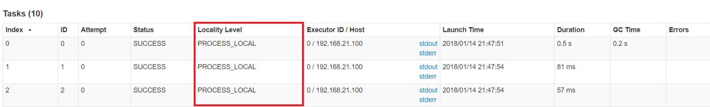
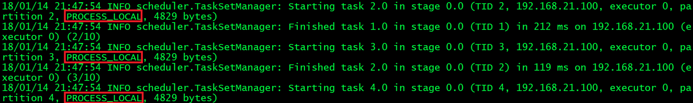

[toc]

# Spark性能调优03-数据本地化调优
摘抄自：`https://cloud.tencent.com/developer/article/1336631`

## 1. task数据本地化级别

### (1) PROCESS_LOCAL：进程本地化



### (2) NODE_LOCAL：节点本地化



### (3) NO_PREF：没有本地化级别



### (4) RACK_LOCAL：机架本地化



### (5) ANY：跨机架取数据



## 2. TaskScheduler发送task选择本地化级别的策略

比如计算需要的数据在node01这台服务器中的Executor1这个进程中，那么TaskScheduler会把TaskSet发往Executor1进程中执行，此时的数据本地化级别时PROCESS_LOCAL，Executor1是最佳的计算位置，如果发送的task在等待了3秒，重试了5次之后仍然没有执行，那么TaskScheduler就认为Executor1的资源不充足，不足以支撑计算，那么降低数据本地化级别，把task发往node01的另外一个进程Executor2中，这时的数据本地化级别为NODE_LOCAL，如果还无法执行，降低为RACK_LOCAL，ANY，直到Task可以开始计算

## 3. 查看某任务的数据本地化级别的方法

### (1) 在Spark Web UI中查看



### (2) 查看Spark作业的执行日志



## 4. 修改task数据本地化级别的方法

增加等待时间，默认3s，可以成倍数提高，按照6s，12s，24s…这样的方式来修改，这样可以快速找到最佳值，配置参数：

```sh
# 可以调整全部级别的task执行等待时间，也可以分别调整
spark.locality.wait         default(3s)
spark.locality.wait.process default(3s)
spark.locality.wait.node    default(3s)
spark.locality.wait.rack    default(3s)
```

在默认情况下，最初的数据本地化级别为PROCESS_LOCAL，如果等待了3s，重试5次后还没有开始执行task，那么会降低级别，再尝试开始执行task，比如，我们就想让task的数据本地化级别为PROCESS_LOCAL，那么把`spark.locality.wait.process`修改为一个很大的值，那么这个task会一直等待，直到本机的executor中已经加载过来了需要的数据，当然，我们不会这么做。

