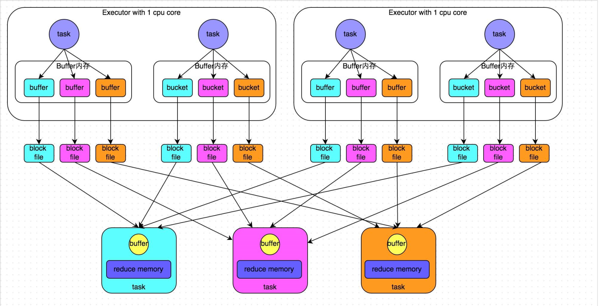
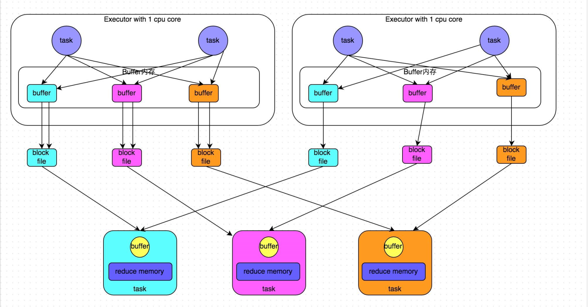
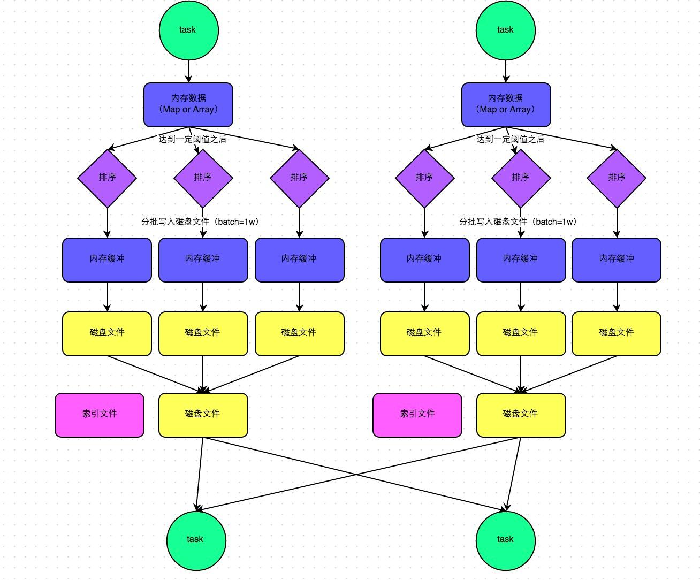
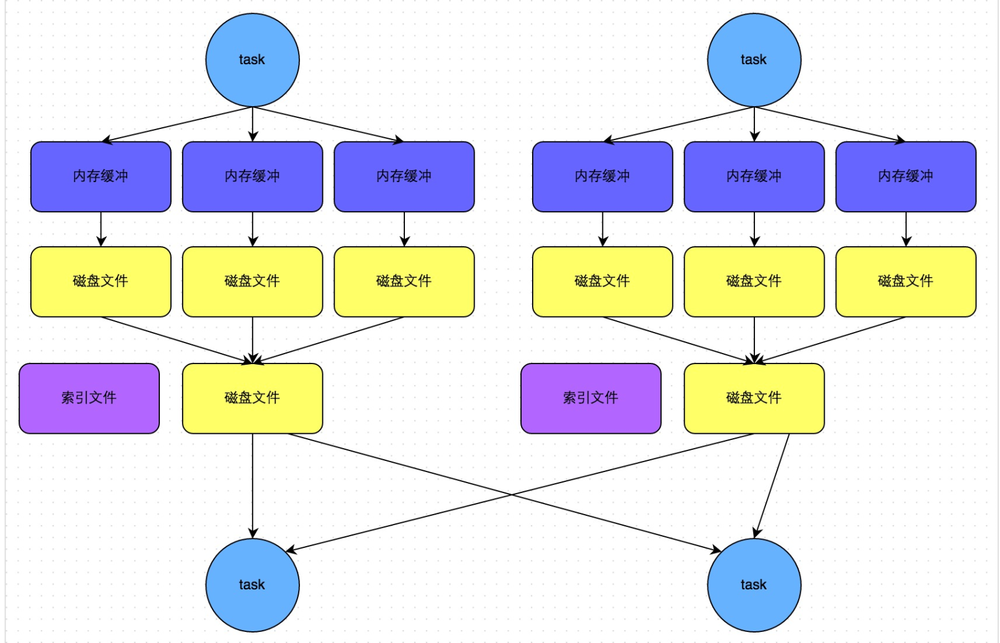
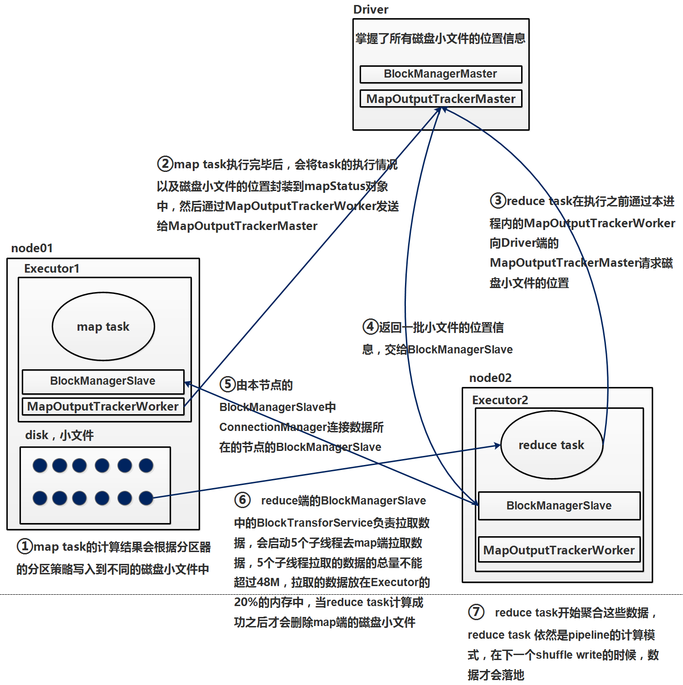

[toc]

# Spark性能调优05-Shuffle调优
摘抄自：`https://cloud.tencent.com/developer/article/1336602`

## 1. Spark Shuffle概述

在Spark的源码中，负责shuffle过程的执行、计算和处理的组件主要就是ShuffleManager，也即shuffle管理器。而随着Spark的版本的发展，ShuffleManager也在不断迭代，变得越来越先进。

在Spark 1.2以前，默认的shuffle计算引擎是HashShuffleManager。该ShuffleManager而HashShuffleManager有着一个非常严重的弊端，就是会产生大量的中间磁盘文件，进而由大量的磁盘IO操作影响了性能。

因此在Spark 1.2以后的版本中，默认的ShuffleManager改成了SortShuffleManager。SortShuffleManager相较于HashShuffleManager来说，有了一定的改进。主要就在于，每个Task在进行shuffle操作时，虽然也会产生较多的临时磁盘文件，但是最后会将所有的临时文件合并（merge）成一个磁盘文件，因此每个Task就只有一个磁盘文件。在下一个stage的shuffle read task拉取自己的数据时，只要根据索引读取每个磁盘文件中的部分数据即可。

下面我们详细分析一下HashShuffleManager和SortShuffleManager的原理。

### (1) 普通的HashShuffle

上图中，每个节点启动一个Executor来运行Application，每个Executor使用1个core，其中有2条task，所以2条task不是并行执行的。Map task每计算一条数据之后，就写到对应的buffer（默认32K）中（比如key为hello的写入到蓝色buffer，key为world的写入到紫色buffer中），当buffer到达阈值后，把其中的数据溢写到磁盘，当task0执行完后，task2开始执行，在这个过程中，每一个map task产生reduce的个数个小文件，假如总共有m个map task，r个reduce，最终会产生m*r个小文件，磁盘小文件和缓存过多，造成耗时且低效的IO操作，可能造成OOM

### (2) 优化的HashShuffle

每个map task 之间可以共享buffer，task0执行完成后，task1开始执行，继续使用task0使用的buffer，假如总共有c个core， r个reduce，最终会产生c*r个小文件，因为复用buffer后，每个core执行的所有map task产生r个小文件

### (3) 普通的SortShuffle

* 每个maptask将计算结果写入内存数据结构中，这个内存默认大小为5M    
* 会有一个“监控器”来不定时的检查这个内存的大小，如果写满了5M，比如达到了5.01M，那么再给这个内存申请5.02M（5.01M * 2 – 5M = 5.02）的内存，此时这个内存空间的总大小为10.02M    
* 当“定时器”再次发现数据已经写满了，大小10.05M，会再次给它申请内存，大小为 10.05M * 2 – 10.02M = 10.08M    
* 假如此时总的内存只剩下5M，不足以再给这个内存分配10.08M，那么这个内存会被锁起来，把里面的数据按照相同的key为一组，进行排序后，分别写到不同的缓存中，然后溢写到不同的小文件中，而map task产生的新的计算结果会写入总内存剩余的5M中    
* buffer中的数据（已经排好序）溢写的时候，会分批溢写，默认一次溢写10000条数据，假如最后一部分数据不足10000条，那么剩下多少条就一次性溢写多少条    
* 每个map task产生的小文件，最终合并成一个大文件来让reduce拉取数据，合成大文件的同时也会生成这个大文件的索引文件，里面记录着分区信息和偏移量（比如：key为hello的数据在第5个字节到第8097个字节）    
* 最终产生的小文件数为2*m（map task的数量）

### (4) SortShuffle的bypass机制

有条件的sort，当shuffle reduce task数量小于`spark.shuffle.sort.bypassMergeThreshold`参数的值（默认200）时，会触发bypass机制，不进行sort，假如目前有300个reduce task，如果要触发bypass机制，就就设置spark.shuffle.sort.bypassMergeThreshold的值大于300，bypass机制最终产生2*m（map task的数量）的小文件。

## 2. Spark Shuffle详解

先了解一些角色：

* MapOutputTracker：管理磁盘小文件的地址
 主：MapOutputTrackerMaster
 从：MapOutputTrackerWorker    
* BlockManager：
 主：BlockManagerMaster，存在于Driver端
 管理范围：
 (1) RDD的缓存数据
 (2) 广播变量
 (3) shuffle过程产生的磁盘小文件
 包含4个重要对象：
 (1) ConnectionManager：负责连接其他的BlockManagerSlave
 (2) BlockTransforService：负责数据传输
 (3) DiskStore：负责磁盘管理
 (4) Memstore：负责内存管理
 从：BlockManagerSlave，存在于Executor端
 包含4个重要对象：
 (1) ConnectionManager：负责连接其他的BlockManagerSlave
 (2) BlockTransforService：负责数据传输
 (3) DiskStore：负责磁盘管理
 (4) Memstore：负责内存管理

shuffle详细过程：

## 3. Shuffle调优

以下是Shffule过程中的一些主要参数，这里详细讲解了各个参数的功能、默认值以及基于实践经验给出的调优建议。

### (1) spark.shuffle.file.buffer

* 默认值：32k    
* 参数说明：该参数用于设置shuffle write task的BufferedOutputStream的buffer缓冲大小。将数据写到磁盘文件之前，会先写入buffer缓冲中，待缓冲写满之后，才会溢写到磁盘。    
* 调优建议：如果作业可用的内存资源较为充足的话，可以适当增加这个参数的大小（比如64k），从而减少shuffle write过程中溢写磁盘文件的次数，也就可以减少磁盘IO次数，进而提升性能。在实践中发现，合理调节该参数，性能会有1%~5%的提升。

### (2) spark.reducer.maxSizeInFlight

* 默认值：48m    
* 参数说明：该参数用于设置shuffle read task的buffer缓冲大小，而这个buffer缓冲决定了每次能够拉取多少数据。    
* 调优建议：如果作业可用的内存资源较为充足的话，可以适当增加这个参数的大小（比如96m），从而减少拉取数据的次数，也就可以减少网络传输的次数，进而提升性能。在实践中发现，合理调节该参数，性能会有1%~5%的提升。

### (3) spark.shuffle.io.maxRetries

* 默认值：3    
* 参数说明：shuffle read task从shuffle write task所在节点拉取属于自己的数据时，如果因为网络异常导致拉取失败，是会自动进行重试的。该参数就代表了可以重试的最大次数。如果在指定次数之内拉取还是没有成功，就可能会导致作业执行失败。    
* 调优建议：对于那些包含了特别耗时的shuffle操作的作业，建议增加重试最大次数（比如60次），以避免由于JVM的full gc或者网络不稳定等因素导致的数据拉取失败。在实践中发现，对于针对超大数据量（数十亿~上百亿）的shuffle过程，调节该参数可以大幅度提升稳定性。

### (4) spark.shuffle.io.retryWait

* 默认值：5s    
* 参数说明：具体解释同上，该参数代表了每次重试拉取数据的等待间隔，默认是5s。    
* 调优建议：建议加大间隔时长（比如60s），以增加shuffle操作的稳定性。

### (5) spark.shuffle.memoryFraction

* 默认值：0.2    
* 参数说明：该参数代表了Executor内存中，分配给shuffle read task进行聚合操作的内存比例，默认是20%。    
* 调优建议：在资源调优中讲解过这个参数。如果内存充足，而且很少使用持久化操作，建议调高这个比例，给shuffle read的聚合操作更多内存，以避免由于内存不足导致聚合过程中频繁读写磁盘。在实践中发现，合理调节该参数可以将性能提升10%左右。

### (6) spark.shuffle.manager

* 默认值：sort    
* 参数说明：该参数用于设置ShuffleManager的类型。Spark 1.5以后，有三个可选项：hash、sort和tungsten-sort。HashShuffleManager是Spark 1.2以前的默认选项，但是Spark 1.2以及之后的版本默认都是SortShuffleManager了。tungsten-sort与sort类似，但是使用了tungsten计划中的堆外内存管理机制，内存使用效率更高。    
* 调优建议：由于SortShuffleManager默认会对数据进行排序，因此如果你的业务逻辑中需要该排序机制的话，则使用默认的SortShuffleManager就可以；而如果你的业务逻辑不需要对数据进行排序，那么建议参考后面的几个参数调优，通过bypass机制或优化的HashShuffleManager来避免排序操作，同时提供较好的磁盘读写性能。这里要注意的是，tungsten-sort要慎用，因为之前发现了一些相应的bug。

### (7) spark.shuffle.sort.bypassMergeThreshold

* 默认值：200    
* 参数说明：当ShuffleManager为SortShuffleManager时，如果shuffle read task的数量小于这个阈值（默认是200），则shuffle write过程中不会进行排序操作，而是直接按照未经优化的HashShuffleManager的方式去写数据，但是最后会将每个task产生的所有临时磁盘文件都合并成一个文件，并会创建单独的索引文件。    
* 调优建议：当你使用SortShuffleManager时，如果的确不需要排序操作，那么建议将这个参数调大一些，大于shuffle read task的数量。那么此时就会自动启用bypass机制，map-side就不会进行排序了，减少了排序的性能开销。但是这种方式下，依然会产生大量的磁盘文件，因此shuffle write性能有待提高。

### (8) spark.shuffle.consolidateFiles

* 默认值：false    
* 参数说明：如果使用HashShuffleManager，该参数有效。如果设置为true，那么就会开启consolidate机制，会大幅度合并shuffle write的输出文件，对于shuffle read task数量特别多的情况下，这种方法可以极大地减少磁盘IO开销，提升性能。    
* 调优建议：如果的确不需要SortShuffleManager的排序机制，那么除了使用bypass机制，还可以尝试将spark.shffle.manager参数手动指定为hash，使用HashShuffleManager，同时开启consolidate机制。在实践中尝试过，发现其性能比开启了bypass机制的SortShuffleManager要高出10%~30%。

参考文章：[Spark性能优化指南——高级篇](https://link.jianshu.com/?t=https://tech.meituan.com/spark-tuning-pro.html "Spark性能优化指南——高级篇")

