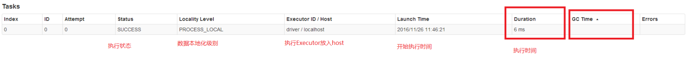

[toc]

# Spark性能调优06-JVM调优
摘抄自：`https://cloud.tencent.com/developer/article/1336614`

## 1. Spark 调优和 JVM 调优的关系

再JVM虚拟机中，当创建的对象的数量很多时，Eden 和 Survior1 区域会很快的满溢，就需要进行频繁地 Minor GC，**这样会导致有一些生命周期较短的对象迅速长到15岁并放入到老年代中，导致老年代中存放大量的短生命周期的对象**(正常请况下，老年代应该存放的是数量比较少并且会长期使用的对象，比如数据库连接池)，当老年代满溢后，会进行Full GC，Full GC是开启一个很消耗性能和时间的线程，而且不管 Minor GC 还是 Full GC 都会导致 JVM 的工作线程停止，因为 Scala 也是基于 JVM 的编程语言，所以运行 Spark 程序和运行 Java 程序在 JVM 中的内存分配情况是相同的。

当一个 Spark 的 task 执行时，可能会创建大数据量的对象，比如我们使用 foreach 来存数据的时候，有多少条数据就会创建多少个对象(自定义对象封装数据)，有一千万条数据就会创建一千万个对象放到年轻代内存区中，导致频繁地 Minor GC 和 Full GC，如果 GC 仍然不能满足内存要求，就会报OOM错误。

总之，堆内存不足的造成的影响如下：
 * (1) 频繁地 Minor GC
 * (2) 老年代中大量的短生命周期的对象造成 Full GC
 * (3) 有 GC 就会影响 Spark 的性能和运行速度

## 2. 如何查看spark作业运行过程中的GC时间

## 3. Spark的JVM调优

#### spark.storage.memoryFraction

* 参数说明：
 该参数用于设置RDD持久化数据在Executor内存中能占的比例，默认是0.6。也就是说，默认Executor 60%的内存，可以用来保存持久化的RDD数据。根据你选择的不同的持久化策略，如果内存不够时，可能数据就不会持久化，或者数据会写入磁盘    
* 参数调优建议：
 如果Spark作业中，有较多的RDD持久化操作，该参数的值可以适当提高一些，保证持久化的数据能够容纳在内存中。避免内存不够缓存所有的数据，导致数据只能写入磁盘中，降低了性能。但是如果Spark作业中的shuffle类操作比较多，而持久化操作比较少，那么这个参数的值适当降低一些比较合适。此外，如果发现作业由于频繁的gc导致运行缓慢（通过spark web ui可以观察到作业的gc耗时），意味着task执行用户代码的内存不够用，那么同样建议调低这个参数的值

#### spark.shuffle.memoryFraction

* 参数说明：
 该参数用于设置shuffle过程中一个task拉取到上个stage的task的输出后，进行聚合操作时能够使用的Executor内存的比例，默认是0.2。也就是说，Executor默认只有20%的内存用来进行该操作。shuffle操作在进行聚合时，如果发现使用的内存超出了这个20%的限制，那么多余的数据就会溢写到磁盘文件中去，此时就会极大地降低性能    
* 参数调优建议：
 如果Spark作业中的RDD持久化操作较少，shuffle操作较多时，建议降低持久化操作的内存占比，提高shuffle操作的内存占比比例，避免shuffle过程中数据过多时内存不够用，必须溢写到磁盘上，降低了性能。此外，如果发现作业由于频繁的gc导致运行缓慢，意味着task执行用户代码的内存不够用，那么同样建议调低这个参数的值

资源参数的调优，没有一个固定的值，需要根据自己的实际情况（包括Spark作业中的shuffle操作数量、RDD持久化操作数量以及spark web ui中显示的作业gc情况）来灵活的调优

## 4. 常见故障解决

### (1) shuffle file not find：shuffle过程磁盘小文件找不到

可能造成该问题的原因：

**(1) 由于堆内内存不足导致 Executor 挂掉，从而 BlockManasger对象被回收**

解决办法:
 增加 Executor 的内存，调整`--executor-memory(spark.executor.memory)`的值

**(2) 由于堆外内存不足导致的Executor挂掉的话**

Spark的shuffle部分使用了netty框架进行网络传输，但netty会申请堆外内存缓存(PooledByteBufAllocator ，AbstractByteBufAllocator)；Shuffle时，每个Reduce都需要获取每个map对应的输出，当一个reduce需要获取的一个map数据比较大(比如1G)，这时候就会申请一个1G的堆外内存，而堆外内存是有限制的，这时候就出现了堆外内存溢出

解决办法：提高堆外内存

`--conf spark.yarn.executor.memoryOverhead=2048`
这个配置项用于yarn集群，并且是在提交Application的时候指定的

`--conf spark.executor.memoryOverhead=2048`
这个配置项用于standalone集群，并且是在提交Application的时候指定的

**(3) Executor没有挂掉，建立通信的时候发生了GC**

解决办法:
`--conf spark.core.connection.ack.wait.timeout=60`
这个配置项必须是在提交Application的时候通过--conf来设置

**(4) 拉取数据的时候遇到GC**

解决办法：
 增加重试次数和重试间隔时间
 `--conf spark.shuffle.io.maxRetries`
 `--conf spark.shuffle.io.retryWait`

