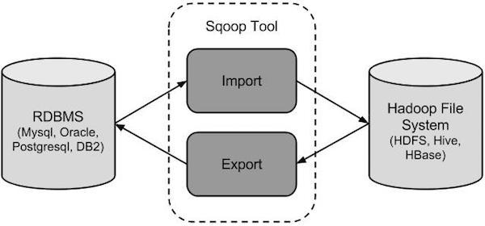

sqoop 是 apache 旗下一款“Hadoop 和关系数据库服务器之间传送数据”的工具。

核心的功能有两个：导入、迁入，导出、迁出。

导入数据：MySQL，Oracle 导入数据到 Hadoop 的 HDFS、HIVE、HBASE 等数据存储系统

导出数据：从 Hadoop 的文件系统中导出数据到关系数据库 mysql 等 Sqoop 的本质还是一个命令行工具，和 HDFS，Hive 相比，并没有什么高深的理论。

sqoop：
工具：本质就是迁移数据， 迁移的方式：就是把sqoop的迁移命令转换成MR程序

hive
工具，本质就是执行计算，依赖于HDFS存储数据，把SQL转换成MR程序



## 一、Sqoop的基本命令
### 1、sqoop help
首先，我们可以使用 sqoop help 来查看，sqoop 支持哪些命令
```
[hadoop@hadoop01 ~]$ sqoop help
Available commands:
  codegen            Generate code to interact with database records
  create-hive-table  Import a table definition into Hive
  eval               Evaluate a SQL statement and display the results
  export             Export an HDFS directory to a database table
  help               List available commands
  import             Import a table from a database to HDFS
  import-all-tables  Import tables from a database to HDFS
  import-mainframe   Import datasets from a mainframe server to HDFS
  job                Work with saved jobs
  list-databases     List available databases on a server
  list-tables        List available tables in a database
  merge              Merge results of incremental imports
  metastore          Run a standalone Sqoop metastore
  version            Display version information

See 'sqoop help COMMAND' for information on a specific command.
```

### 2、list-databases
列出MySQL数据有哪些数据库
```
sqoop list-databases \
--connect jdbc:mysql://hadoop01:3306/ \
--username root \
--password 123456
```

```sh
[hadoop@hadoop01 ~]$ sqoop list-databases \
> --connect jdbc:mysql://hadoop01:3306/ \
> --username root \
> --password 123456

information_schema
azkaban
hive
mysql
oozie
performance_schema
test
```

### 3、list-tables
列出MySQL中的某个数据库有哪些数据表
```
sqoop list-tables \
--connect jdbc:mysql://hadoop01:3306/azkaban \
--username root \
--password 123456
```

```sh
[hadoop@hadoop01 ~]$ sqoop list-tables \
> --connect jdbc:mysql://hadoop01:3306/azkaban \
> --username root \
> --password 123456

active_executing_flows
active_sla
execution_flows
execution_jobs
execution_logs
project_events
project_files
project_flows
project_permissions
project_properties
project_versions
projects
properties
schedules
triggers
```

### 4、create-hive-table
创建一张跟mysql中的help_keyword表一样的hive表hk：
```
sqoop create-hive-table \
--connect jdbc:mysql://hadoop01:3306/mysql \
--username root \
--password 123456 \
--table help_keyword \
--hive-table hk
```

创建一张跟mysql中的help_keyword表一样的hive表hk（指定数据库testdb）：
```
sqoop create-hive-table \
--connect jdbc:mysql://hadoop01:3306/mysql \
--username root \
--password 123456 \
--table help_keyword \
--hive-database testdb \
--hive-table hk
```

## 二、导入数据
在 Sqoop 中，“导入”概念指：从非大数据集群（RDBMS）向大数据集群（HDFS，HIVE，HBASE）中传输数据，叫做：导入，即使用 import 关键字。

### 1、RDBMS 到 HDFS
在 Mysql 中新建一张表并插入一些数据:
```sql
create database testdb; 
use testdb; 
create table user( 
id int not null auto_increment, 
account varchar(255) default null, 
password varchar(255) default null, 
primary key(id) 
); 
 
insert into user(account, password) values('aaa', '123'); 
insert into user(account, password) values('bbb', '123'); 
insert into user(account, password) values('ccc', '123'); 
insert into user(account, password) values('ddd', '123'); 
insert into user(account, password) values('eee', '123'); 
insert into user(account, password) values('fff', '123'); 
insert into user(account, password) values('ggg', '123'); 
insert into user(account, password) values('hhh', '123');
```

导入数据：
#### 全部导入
```
sqoop import \
--connect jdbc:mysql://hadoop01:3306/testdb \
--username root \
--password 123456 \
--table user \
--target-dir /sqoop/import/user \
--delete-target-dir \
--num-mappers 1 \
--fields-terminated-by '\t'
```

#### columns指定导入的字段
注：--columns account,password字段之间不能有空格
```
sqoop import \
--connect jdbc:mysql://hadoop01:3306/testdb \
--username root \
--password 123456 \
--table user \
--columns account,password \
--target-dir /sqoop/import/user \
--delete-target-dir \
--num-mappers 1 \
--fields-terminated-by ','
```
**提示：columns 中如果涉及到多列，用逗号分隔，分隔时不要添加空格**

#### query选项实现查询导入
query, where子句必须有$CONDITIONS(固定写法)
```
sqoop import \
--connect jdbc:mysql://hadoop01:3306/testdb \
--username root \
--password 123456 \
--query 'select account,password from user where account="ddd" and $CONDITIONS' \
--target-dir /sqoop/import/user \
--delete-target-dir \
--num-mappers 1 \
--fields-terminated-by '\t'
```

```
提示：must contain '$CONDITIONS' in WHERE clause.  
提示：如果 query 后使用的是双引号，则$CONDITIONS  前必须加转移符，防止 shell识别为自己的变量。  
提示：--query 选项，不能同时与--table 等选项使用  
```

```
在以上需要按照自定义SQL语句导出数据到HDFS的情况下：
1、引号问题，要么外层使用单引号，内层使用双引号，$CONDITIONS的$符号不用转义， 要么外层使用双引号，那么内层使用单引号，然后$CONDITIONS的$符号需要转义
2、自定义的SQL语句中必须带有WHERE \$CONDITIONS
```

**自定义sql语句的where条件中必须包含字符串 `$CONDITIONS`，`$CONDITIONS`是一个变量，用于给多个map任务划分任务范围**
#### where选项实现查询导入
```
sqoop import \
--connect jdbc:mysql://hadoop01:3306/testdb \
--username root \
--password 123456 \
--table user \
--where 'id > 5 and account like "f%"' \
--target-dir /sqoop/import/user_where \
--delete-target-dir \
--num-mappers 1 \
--fields-terminated-by '\t'
```

### 2、RDBMS 到 Hive
hive的database要提前创建：
···
hive -e "create database testdb"
···

导出到hive：
```
sqoop import \
--connect jdbc:mysql://hadoop01:3306/testdb \
--username root \
--password 123456 \
--table user \
--hive-import \
--hive-database testdb \
--hive-table user_to_hive \
--hive-overwrite \
--num-mappers 1 \
--fields-terminated-by '\t'
```
提示：该过程分为两步，第一步将数据导入到 HDFS，第二步将导入到 HDFS 的数据迁移到 Hive 仓库

提示：第一步默认的临时目录是/user/admin(用户名)/表名

### 3、RDBMS 到 HBase
```
sqoop import \
--connect jdbc:mysql://hadoop01:3306/testdb \
--username root \
--password 123456 \
--table user \
--columns "id,account,password" \
--column-family "info" \
--hbase-create-table \
--hbase-row-key "id" \
--hbase-table "hbase_user_hive" \
--num-mappers 1 \
--split-by id
```
提示：sqoop1.4.6只支持HBase1.0.1之前的版本的自动创建HBase表的功能

解决方案：手动创建HBase表
```
hbase shell

hbase> create 'hbase_user_hive','info'
```
(5) 在HBase中scan这张表得到如下内容
```
hbase> scan 'hbase_user_hive'
```


hbase查看：
```sql
hbase(main):001:0> create 'hbase_user_hive','info'
0 row(s) in 1.6210 seconds

=> Hbase::Table - hbase_user_hive
hbase(main):002:0> scan 'hbase_user_hive'
ROW                                             COLUMN+CELL                                                                                                                                
0 row(s) in 0.1560 seconds

hbase(main):003:0> scan 'hbase_user_hive'
ROW                                             COLUMN+CELL                                                                                                                                
 1                                              column=info:account, timestamp=1564925650529, value=aaa                                                                                    
 1                                              column=info:password, timestamp=1564925650529, value=123                                                                                   
 2                                              column=info:account, timestamp=1564925650529, value=bbb                                                                                    
 2                                              column=info:password, timestamp=1564925650529, value=123                                                                                   
 3                                              column=info:account, timestamp=1564925650529, value=ccc                                                                                    
 3                                              column=info:password, timestamp=1564925650529, value=123                                                                                   
 4                                              column=info:account, timestamp=1564925650529, value=ddd                                                                                    
 4                                              column=info:password, timestamp=1564925650529, value=123                                                                                   
 5                                              column=info:account, timestamp=1564925650529, value=eee                                                                                    
 5                                              column=info:password, timestamp=1564925650529, value=123                                                                                   
 6                                              column=info:account, timestamp=1564925650529, value=fff                                                                                    
 6                                              column=info:password, timestamp=1564925650529, value=123                                                                                   
 7                                              column=info:account, timestamp=1564925650529, value=ggg                                                                                    
 7                                              column=info:password, timestamp=1564925650529, value=123                                                                                   
 8                                              column=info:account, timestamp=1564925650529, value=hhh                                                                                    
 8                                              column=info:password, timestamp=1564925650529, value=123                                                                                   
8 row(s) in 0.0810 seconds

hbase(main):004:0> 
```

## 三、导出数据
在 Sqoop 中，“导出”概念指：从大数据集群（HDFS，HIVE，HBASE）向非大数据集群（RDBMS）中传输数据，叫做：导出，即使用 export 关键字。

### HIVE/HDFS 到 RDBMS
创建mysql中的表
```sql
create table user_from_hive like user;
```

导出数据到MySql
```
sqoop export \
--connect jdbc:mysql://hadoop01:3306/testdb \
--username root \
--password 123456 \
--table user_from_hive \
--export-dir /user/hive/warehouse/testdb.db/user_to_hive \
--input-fields-terminated-by '\t' \
--num-mappers 1
```

**提示：Mysql中如果表不存在，不会自动创建**

```
sqoop export \
--connect jdbc:mysql://hadoop01:3306/testdb \
--username root \
--password 123456 \
--table user_from_hive \
--export-dir /sqoop/import/user_where \
--input-fields-terminated-by '\t' \
--num-mappers 1
```

多次导出会一直显示：map 100% reduce 0%
是因为mysql的主键冲突了，清空表中的数据后，任务才会运行完。

## 四、一些参数解释
### --split-by
一个错误
```
ERROR tool.ImportTool: Error during import: No primary key could be found for table stu. Please specify one with --split-by or perform a sequential import with '-m 1'.
```
提示可以看出，在我们从mysql中导出的表没有设定主键，提示我们使用把--split-by或者把参数-m设置为1，这里大家会不会问到，这倒是是为什么呢？

* Sqoop通可以过–split-by指定切分的字段，–m设置mapper的数量。通过这两个参数分解生成m个where子句，进行分段查询。  
* split-by 根据不同的参数类型有不同的切分方法，如表共有100条数据其中id为int类型，并且我们指定–split-by id，我们不设置map数量使用默认的为四个，首先Sqoop会取获取切分字段的MIN()和MAX()即（–split -by），再根据map数量进行划分，这是字段值就会分为四个map：（1-25）（26-50）（51-75）（75-100）。  
* 根据MIN和MAX不同的类型采用不同的切分方式支持有Date,Text,Float,Integer， Boolean,NText,BigDecimal等等。  
* 所以，若导入的表中没有主键，将-m 设置称1或者设置split-by，即只有一个map运行，缺点是不能并行map录入数据。（注意，当-m 设置的值大于1时，split-by必须设置字段） 。  
* split-by即便是int型，若不是连续有规律递增的话，各个map分配的数据是不均衡的，可能会有些map很忙，有些map几乎没有数据处理的情况。  
 
### --delete-target-dir
```
sqoop import \
--connect jdbc:mysql://hadoop01:3306/testdb \
--username root \
--password 123456 \
--table user \
--target-dir /sqoop/import/user \
--num-mappers 1 \
--fields-terminated-by '\t'
```

出现一个错误，在hdfs上已经存，错误如下：
```
ERROR tool.ImportTool: Encountered IOException running import job: org.apache.hadoop.mapred.FileAlreadyExistsException: Output directory hdfs://hadoop01:9000/sqoop/import/user already exists
	at org.apache.hadoop.mapreduce.lib.output.FileOutputFormat.checkOutputSpecs(FileOutputFormat.java:146)
	at org.apache.hadoop.mapreduce.JobSubmitter.checkSpecs(JobSubmitter.java:267)
	at org.apache.hadoop.mapreduce.JobSubmitter.submitJobInternal(JobSubmitter.java:140)
	at org.apache.hadoop.mapreduce.Job$10.run(Job.java:1297)
	at org.apache.hadoop.mapreduce.Job$10.run(Job.java:1294)
	at java.security.AccessController.doPrivileged(Native Method)
	at javax.security.auth.Subject.doAs(Subject.java:415)
	at org.apache.hadoop.security.UserGroupInformation.doAs(UserGroupInformation.java:1656)
	at org.apache.hadoop.mapreduce.Job.submit(Job.java:1294)
	at org.apache.hadoop.mapreduce.Job.waitForCompletion(Job.java:1315)
	at org.apache.sqoop.mapreduce.ImportJobBase.doSubmitJob(ImportJobBase.java:196)
	at org.apache.sqoop.mapreduce.ImportJobBase.runJob(ImportJobBase.java:169)
	at org.apache.sqoop.mapreduce.ImportJobBase.runImport(ImportJobBase.java:266)
	at org.apache.sqoop.manager.SqlManager.importTable(SqlManager.java:673)
	at org.apache.sqoop.manager.MySQLManager.importTable(MySQLManager.java:118)
	at org.apache.sqoop.tool.ImportTool.importTable(ImportTool.java:497)
	at org.apache.sqoop.tool.ImportTool.run(ImportTool.java:605)
	at org.apache.sqoop.Sqoop.run(Sqoop.java:143)
	at org.apache.hadoop.util.ToolRunner.run(ToolRunner.java:70)
	at org.apache.sqoop.Sqoop.runSqoop(Sqoop.java:179)
	at org.apache.sqoop.Sqoop.runTool(Sqoop.java:218)
	at org.apache.sqoop.Sqoop.runTool(Sqoop.java:227)
	at org.apache.sqoop.Sqoop.main(Sqoop.java:236)
```

删除目标目录后在导入,并且指定mapreduce的job的名字
```
参数：--delete-target-dir --mapreduce-job-name
```

### --null-non-string
```
–null-string含义是 string类型的字段，当Value是NULL，替换成指定的字符
–null-non-string 含义是非string类型的字段，当Value是NULL，替换成指定字符先
```

```
导入薪资表
[hadoop@zhangyu lib]$ sqoop import \
> --connect jdbc:mysql://localhost:3306/sqoop \
> --username root --password 123456 \
> --table sal \
> --mapreduce-job-name FromMySQL2HDFS \
> --delete-target-dir \
> --fields-terminated-by '\t' \
> -m 1

查询结果：
[hadoop@zhangyu lib]$  hdfs dfs -cat /user/hadoop/sal/part-m-00000
zhangsan        1000
lisi    2000
wangwu  null

加上参数`--null-string
[hadoop@zhangyu lib]$ sqoop import \
> --connect jdbc:mysql://localhost:3306/sqoop \
> --username root --password 123456 \
> --table sal \
> --mapreduce-job-name FromMySQL2HDFS \
> --delete-target-dir \
> --fields-terminated-by '\t' \
> -m 1 \
> --null-string 0

查看结果
[hadoop@zhangyu lib]$  hdfs dfs -cat /user/hadoop/sal/part-m-00000
zhangsan        1000
lisi    2000
wangwu  0
```

### --input-null-string
sqoop导入hive数据到MySql碰到hive表中列的值为null的情况。 
```
在导入数据的过程中，如果碰到列值为null的情况，hive中为null的是以\N代替的，所以你在导入到MySql时，需要加上两个参数：
--input-null-string '\\N' --input-null-non-string '\\N'，多加一个'\'，是为转义。
```

### --query
使用--query关键字，就不能使用--table和--columns

**自定义sql语句的where条件中必须包含字符串 `$CONDITIONS`，`$CONDITIONS`是一个变量，用于给多个map任务划分任务范围**

```
sqoop import \
--connect jdbc:mysql://localhost:3306/sqoop \
--username root --password 123456 \
--mapreduce-job-name FromMySQL2HDFS \
--delete-target-dir \
--fields-terminated-by '\t' \
-m 1 \
--null-string 0 \
--target-dir STU_COLUMN_QUERY \
--query "select * from stu where id>1 and \$CONDITIONS"
```

### –create-hive-table
创建目标表，如果有会报错

导入Hive不建议大家使用–create-hive-table,建议事先创建好hive表
使用create创建表后，我们可以查看字段对应的类型，发现有些并不是我们想要的类型，所以我们要事先创建好表的结构再导入数据。


### 导入到hive指定分区
```
--hive-partition-key <partition-key>             Sets the partition key
                                                    to use when importing
                                                    to hive
 --hive-partition-value <partition-value>         Sets the partition
                                                    value to use when
                                                    importing to hive
```

示例：
```
[hadoop@zhangyu lib]$ sqoop import \
> --connect jdbc:mysql://localhost:3306/sqoop \
> --username root --password 123456 \
> --table stu \
> --create-hive-table \
> --hive-database hive \
> --hive-import \
> --hive-overwrite \
> --hive-table stu_import1 \
> --mapreduce-job-name FromMySQL2HDFS \
> --delete-target-dir \
> --fields-terminated-by '\t' \
> -m 1 \
> --null-non-string 0 \
> --hive-partition-key dt \
> --hive-partition-value "2018-08-08"
```

hive上进行查询
```
hive> select * from stu_import1;
OK
1       zhangsan        2018-08-08
2       lisi    2018-08-08
3       wangwu  2018-08-08
Time taken: 0.121 seconds, Fetched: 3 row(s)
```

### 最后我们看看常用脚本把
```shell
#!/bin/bash

#Hive2Pg

IP=localhost
Database=dufault
Driver=jdbc:postgresql

pg_connection=${Driver}://${IP}/${Database}
pg_username=root
pg_password=123456

hive_db=default
hive_table=hive_table
hive_columns=id,name,age
 
 
#需要导出的数据pg表名
export_table_name=pg_test
 
 
#需要导出的数据pg列名
export_table_columns=id,name,age

 
#需要导出到pg的数据的临时文件目录
sqoop_export_data_dir=/tmp/sqoop/export/${export_table_name}
 
hadoop dfs -rm -r ${sqoop_export_data_dir};
#创建用于导出到pg的临时数据
hive -v -e "
use ${hive_db};
insert overwrite directory '${sqoop_export_data_dir}'
select
${hive_columns}
from ${hive_db}.${hive_table};";

#先删除目的数据库的数据
sqoop eval --connect ${pg_connection}  \
--username ${pg_username}  \
--password ${pg_password} \
--verbose --query "delete from ${export_table_name}";

 
#再导出数据
sqoop export --connect ${pg_connection} \
--username ${pg_username} \
--password ${pg_password} \
--export-dir ${sqoop_export_data_dir} \
--verbose --num-mappers 1 \
--table ${export_table_name} \
--columns ${export_table_columns} \
--input-fields-terminated-by '\001' \
--input-lines-terminated-by '\n' \
--input-null-string '\\N' \
--input-null-non-string '\\N'
```

