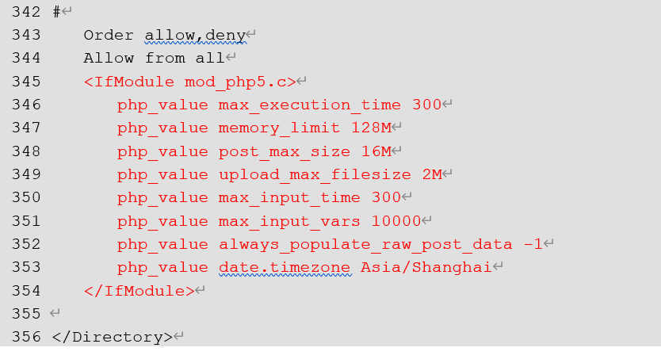
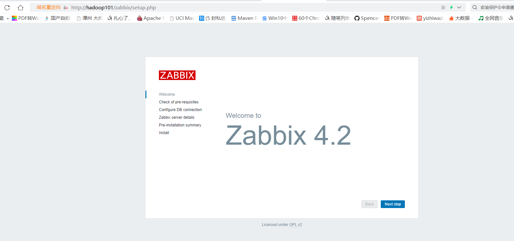
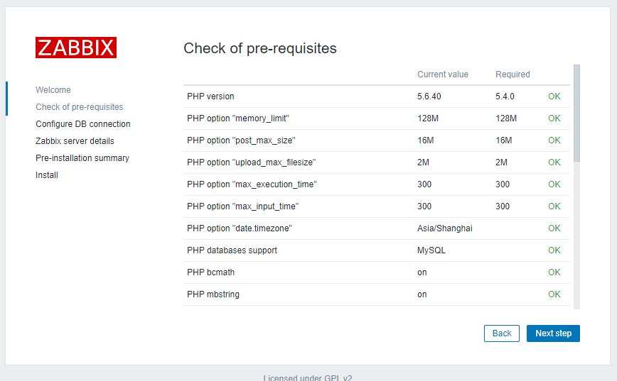
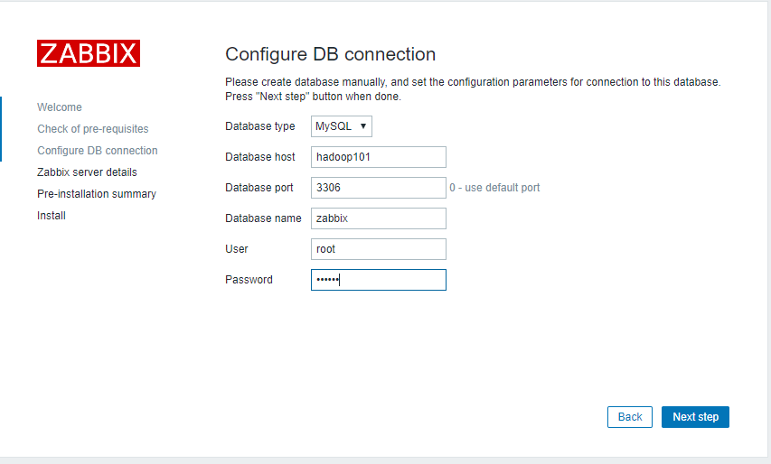
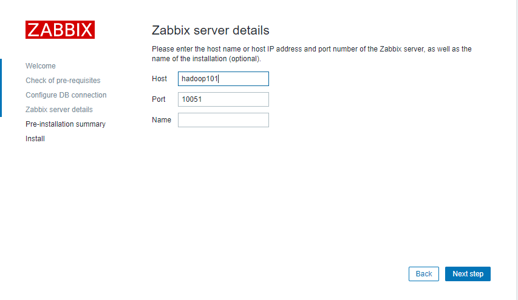
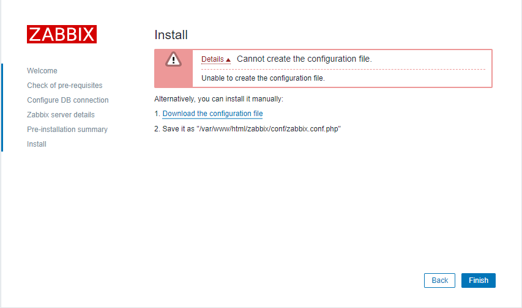
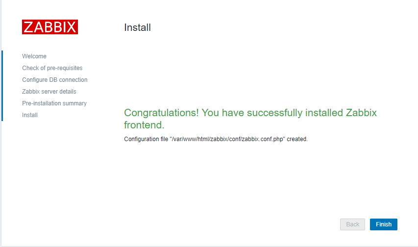
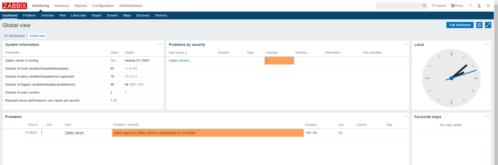

# 准备

## 集群规划
| 节点      | 服务                                           |
| --------- | ---------------------------------------------- |
| hadoop101 | zabbix-server、zabbix-agent、MySQL、zabbix-web |
| hadoop102 | zabbix-agent                                   |
| hadoop103 | zabbix-agent                                   |

## 准备工作

### 关闭防火墙
```
sudo service iptables status
sudo service iptables stop
sudo chkconfig iptables off
```

### 关闭SELinux
只需要关闭在hadoop101上的即可，zabbix-web使用php，需要关闭。

1) 修改配置文件/etc/selinux/config

修改SELINUX=disabled：
```
sudo vi /etc/selinux/config

# This file controls the state of SELinux on the system.
# SELINUX= can take one of these three values:
#     enforcing - SELinux security policy is enforced.
#     permissive - SELinux prints warnings instead of enforcing.
#     disabled - No SELinux policy is loaded.
SELINUX=disabled
# SELINUXTYPE= can take one of these two values:
#     targeted - Targeted processes are protected,
#     mls - Multi Level Security protection.
SELINUXTYPE=targeted

```

2）重启服务器
```
sudo reboot
```

# Zabbix安装之server节点
就是101上需要的

## Zabbix-server/agent编译及安装

### 创建用户
官网上就是这样要求的
```sh
sudo groupadd --system zabbix
sudo useradd --system -g zabbix -d /usr/lib/zabbix -s /sbin/nologin -c "Zabbix Monitoring System" zabbix
```

### 上传zabbix安装包并解压
centos6用yum在线安装有问题，只能自己编译安装。


zabbix需要mysql的依赖比较多，把之前没安装的安装上
```
[hadoop@hadoop101 zabbix]$ pwd
/opt/software/zabbix
[hadoop@hadoop101 zabbix]$ ll
total 236144
-rw-rw-r-- 1 hadoop hadoop 18509960 Jul 25 20:49 MySQL-client-5.6.24-1.el6.x86_64.rpm
-rw-rw-r-- 1 hadoop hadoop  3408004 Jul 25 20:49 MySQL-devel-5.6.24-1.el6.x86_64.rpm
-rw-rw-r-- 1 hadoop hadoop 88748476 Jul 25 20:50 MySQL-embedded-5.6.24-1.el6.x86_64.rpm
-rw-rw-r-- 1 hadoop hadoop 55782196 Jul 25 20:50 MySQL-server-5.6.24-1.el6.x86_64.rpm
-rw-rw-r-- 1 hadoop hadoop  1953680 Jul 25 20:50 MySQL-shared-5.6.24-1.el6.x86_64.rpm
-rw-rw-r-- 1 hadoop hadoop  3969728 Jul 25 20:50 MySQL-shared-compat-5.6.24-1.el6.x86_64.rpm
-rw-rw-r-- 1 hadoop hadoop 51088160 Jul 25 20:50 MySQL-test-5.6.24-1.el6.x86_64.rpm
-rw-rw-r-- 1 hadoop hadoop 18332348 Jul 25 20:49 zabbix-4.2.8.tar.gz
```

解压：
```sh
[hadoop@hadoop101 zabbix]$ tar -zxf zabbix-4.2.8.tar.gz 
[hadoop@hadoop101 zabbix]$ cd zabbix-4.2.8
[hadoop@hadoop101 zabbix-4.2.8]$ ll
total 1784
-rw-r--r--  1 hadoop hadoop   54052 Oct 28  2019 aclocal.m4
-rw-r--r--  1 hadoop hadoop      98 Oct 28  2019 AUTHORS
drwxr-xr-x  4 hadoop hadoop    4096 Oct 28  2019 bin
drwxr-xr-x  4 hadoop hadoop    4096 Oct 28  2019 build
-rw-r--r--  1 hadoop hadoop 1036613 Oct 28  2019 ChangeLog
-rwxr-xr-x  1 hadoop hadoop    7333 Jan 26  2017 compile
drwxr-xr-x  3 hadoop hadoop    4096 Oct 28  2019 conf
-rwxr-xr-x  1 hadoop hadoop   43940 Nov 13  2016 config.guess
-rwxr-xr-x  1 hadoop hadoop   36339 Nov 13  2016 config.sub
-rwxr-xr-x  1 hadoop hadoop  403103 Oct 28  2019 configure
-rw-r--r--  1 hadoop hadoop   56865 Oct 28  2019 configure.ac
-rw-r--r--  1 hadoop hadoop   17990 Oct 28  2019 COPYING
drwxr-xr-x  8 hadoop hadoop    4096 Oct 28  2019 database
-rwxr-xr-x  1 hadoop hadoop   23566 Jan 26  2017 depcomp
drwxr-xr-x  3 hadoop hadoop    4096 Oct 28  2019 frontends
drwxr-xr-x  2 hadoop hadoop    4096 Oct 28  2019 include
-rw-r--r--  1 hadoop hadoop      82 Oct 28  2019 INSTALL
-rwxr-xr-x  1 hadoop hadoop   15155 Jan 26  2017 install-sh
drwxr-xr-x  2 hadoop hadoop    4096 Oct 28  2019 m4
-rw-r--r--  1 hadoop hadoop    6324 Oct 28  2019 Makefile.am
-rw-r--r--  1 hadoop hadoop   36085 Oct 28  2019 Makefile.in
drwxr-xr-x  2 hadoop hadoop    4096 Oct 28  2019 man
drwxr-xr-x  5 hadoop hadoop    4096 Oct 28  2019 misc
-rwxr-xr-x  1 hadoop hadoop    6872 Jan 26  2017 missing
-rw-r--r--  1 hadoop hadoop      52 Oct 28  2019 NEWS
-rw-r--r--  1 hadoop hadoop    1317 Oct 28  2019 README
drwxr-xr-x  4 hadoop hadoop    4096 Oct 28  2019 sass
drwxr-xr-x 10 hadoop hadoop    4096 Oct 28  2019 src
```

### 创建zabbix数据库和表
进入/opt/software/zabbix-4.2.8/database/mysql路径
```
[hadoop@hadoop101 mysql]$ pwd
/opt/software/zabbix/zabbix-4.2.8/database/mysql
[hadoop@hadoop101 mysql]$ ll
total 6124
-rw-r--r-- 1 hadoop hadoop 4128170 Oct 28  2019 data.sql
-rw-r--r-- 1 hadoop hadoop 1978341 Oct 28  2019 images.sql
-rw-r--r-- 1 hadoop hadoop     392 Oct 28  2019 Makefile.am
-rw-r--r-- 1 hadoop hadoop   15711 Oct 28  2019 Makefile.in
-rw-r--r-- 1 hadoop hadoop  142074 Oct 28  2019 schema.sql
```

执行这三个sql文件，需要按顺序执行，顺序：schema.sql、data.sql、images.sql。

在当前路径进去mysql执行：
```
[hadoop@hadoop101 mysql]$ mysql -uroot -p123456
mysql> 
```
执行语句：
```sql
create database zabbix default character set utf8 collate utf8_bin;
    
use zabbix;

source schema.sql;

source data.sql;

source images.sql;
```

### 编译环境准备

#### 安装所需msyql依赖
```
sudo rpm -ivh MySQL-devel-5.6.24-1.el6.x86_64.rpm
sudo rpm -ivh MySQL-embedded-5.6.24-1.el6.x86_64.rpm
sudo rpm -ivh MySQL-shared-5.6.24-1.el6.x86_64.rpm
sudo rpm -ivh MySQL-shared-compat-5.6.24-1.el6.x86_64.rpm
```

#### 安装所需依赖
```
sudo rpm -ivh  http://www.city-fan.org/ftp/contrib/yum-repo/rhel6/x86_64/city-fan.org-release-2-1.rhel6.noarch.rpm

# 启用这个源，手动改配置文件也行
sudo yum-config-manager --enable city-fan.org

sudo rpm -ivh http://dl.fedoraproject.org/pub/epel/6/x86_64/Packages/l/libnghttp2-1.6.0-1.el6.1.x86_64.rpm

# 卸载
sudo rpm -e --nodeps libxml2-python-2.7.6-21.el6.x86_64

sudo yum install -y libcurl libcurl-devel libxml2 libxml2-devel net-snmp-devel libevent-devel pcre-devel gcc-c++
```

### 编译及安装
进入解压的zabbix目录`/opt/software/zabbix/zabbix-4.2.8`，在此目录执行下面的操作：
```sh
# 安装server和agent，数据库使用mysql
./configure --enable-server --enable-agent --with-mysql --enable-ipv6 --with-net-snmp --with-libcurl --with-libxml2

# 默认安装在/usr/local下需要权限
sudo make install
```

### 修改配置文件

#### 修改zabbix-server配置文件
主要配置数据库
```sh
sudo vim /usr/local/etc/zabbix_server.conf

DBHost=hadoop101
DBName=zabbix
DBUser=root
DBPassword=123456
```

#### 修改zabbix-agent配置文件
告诉agent哪个是Server，注释两个。
```sh
sudo vim /usr/local/etc/zabbix_agentd.conf

Server=hadoop101
#ServerActive=127.0.0.1
#Hostname=Zabbix server
```

### 编写系统服务脚本
#### zabbix-server
1）编辑zabbix-server文件
```
sudo vi /etc/init.d/zabbix-server
```

2）内容如下
```sh
#!/bin/sh
#
# chkconfig: - 85 15
# description: Zabbix server daemon
# config: /usr/local/etc/zabbix_server.conf
#

### BEGIN INIT INFO
# Provides: zabbix
# Required-Start: $local_fs $network
# Required-Stop: $local_fs $network
# Default-Start:
# Default-Stop: 0 1 2 3 4 5 6
# Short-Description: Start and stop Zabbix server
# Description: Zabbix server
### END INIT INFO

# Source function library.
. /etc/rc.d/init.d/functions

if [ -x /usr/local/sbin/zabbix_server ]; then
    exec=/usr/local/sbin/zabbix_server
else
    exit 5
fi

prog=zabbix_server
conf=/usr/local/etc/zabbix_server.conf
pidfile=/tmp/zabbix_server.pid
timeout=10

if [ -f /etc/sysconfig/zabbix-server ]; then
    . /etc/sysconfig/zabbix-server
fi

lockfile=/var/lock/subsys/zabbix-server

start()
{
    echo -n $"Starting Zabbix server: "
    daemon $exec -c $conf
    rv=$?
    echo
    [ $rv -eq 0 ] && touch $lockfile
    return $rv
}

stop()
{
    echo -n $"Shutting down Zabbix server: "
    killproc -p $pidfile -d $timeout $prog
    rv=$?
    echo
    [ $rv -eq 0 ] && rm -f $lockfile
    return $rv
}

restart()
{
    stop
    start
}

case "$1" in
    start|stop|restart)
        $1
        ;;
    force-reload)
        restart
        ;;
    status)
        status -p $pidfile $prog
        ;;
    try-restart|condrestart)
        if status $prog >/dev/null ; then
            restart
        fi
        ;;
    reload)
        action $"Service ${0##*/} does not support the reload action: " /bin/false
        exit 3
        ;;
    *)
	echo $"Usage: $0 {start|stop|status|restart|try-restart|force-reload}"
	exit 2
	;;
esac
```

3）加执行权限
```sh

```

#### zabbix-agent
编辑zabbix-agent文件
```
sudo vi /etc/init.d/zabbix-agent
```

内容如下
```sh
#!/bin/sh
#
# chkconfig: - 86 14
# description: Zabbix agent daemon
# processname: zabbix_agentd
# config: /usr/local/etc/zabbix_agentd.conf
#

### BEGIN INIT INFO
# Provides: zabbix-agent
# Required-Start: $local_fs $network
# Required-Stop: $local_fs $network
# Should-Start: zabbix zabbix-proxy
# Should-Stop: zabbix zabbix-proxy
# Default-Start:
# Default-Stop: 0 1 2 3 4 5 6
# Short-Description: Start and stop Zabbix agent
# Description: Zabbix agent
### END INIT INFO

# Source function library.
. /etc/rc.d/init.d/functions

if [ -x /usr/local/sbin/zabbix_agentd ]; then
    exec=/usr/local/sbin/zabbix_agentd
else
    exit 5
fi

prog=zabbix_agentd
conf=/usr/local/etc/zabbix_agentd.conf
pidfile=/tmp/zabbix_agentd.pid
timeout=10

if [ -f /etc/sysconfig/zabbix-agent ]; then
    . /etc/sysconfig/zabbix-agent
fi

lockfile=/var/lock/subsys/zabbix-agent

start()
{
    echo -n $"Starting Zabbix agent: "
    daemon $exec -c $conf
    rv=$?
    echo
    [ $rv -eq 0 ] && touch $lockfile
    return $rv
}

stop()
{
    echo -n $"Shutting down Zabbix agent: "
    killproc -p $pidfile -d $timeout $prog
    rv=$?
    echo
    [ $rv -eq 0 ] && rm -f $lockfile
    return $rv
}

restart()
{
    stop
    start
}

case "$1" in
    start|stop|restart)
        $1
        ;;
    force-reload)
        restart
        ;;
    status)
        status -p $pidfile $prog 
        ;;
    try-restart|condrestart)
        if status $prog >/dev/null ; then
            restart
        fi
        ;;
    reload)
        action $"Service ${0##*/} does not support the reload action: " /bin/false
        exit 3
        ;;
    *)
	echo $"Usage: $0 {start|stop|status|restart|try-restart|force-reload}"
	exit 2
	;;
esac
```

加执行权限
```sh
sudo chmod +x /etc/init.d/zabbix-agent
```

## 部署Zabbix-web

### 部署httpd
1）安装httpd
```sh
sudo yum -y install httpd
```

2）修改httpd配置文件
```
sudo vi /etc/httpd/conf/httpd.conf
```

将以下红色部分放至改配置文件的对应位置

```xml
    <IfModule mod_php5.c>
      php_value max_execution_time 300
      php_value memory_limit 128M
      php_value post_max_size 16M
      php_value upload_max_filesize 2M
      php_value max_input_time 300
      php_value max_input_vars 10000
      php_value always_populate_raw_post_data -1
      php_value date.timezone Asia/Shanghai
    </IfModule>
```

3）拷贝zabbix-web的php文件到httpd的指定目录
```sh
sudo mkdir /var/www/html/zabbix

sudo cp -a /opt/software/zabbix/zabbix-4.2.8/frontends/php/* /var/www/html/zabbix/
```

### 安装php5.6
1）安装yum源
```sh
# 我这没有wget
sudo yum -y install wget

wget http://dl.fedoraproject.org/pub/epel/6/x86_64/epel-release-6-8.noarch.rpm

wget http://rpms.famillecollet.com/enterprise/remi-release-6.rpm

sudo rpm -ivh epel-release-6-8.noarch.rpm remi-release-6.rpm
```

2）激活yum源
```sh
sudo yum-config-manager --enable remi-php56
```

3）安装php及相关组件
```sh
sudo yum install -y php php-bcmath php-mbstring php-xmlwriter php-xmlreader php-mcrypt php-cli php-gd php-curl php-mysql php-ldap php-zip php-fileinfo
```

## Zabbix启动

### 启动Zabbix-Server
1）启动
```sh
sudo service zabbix-server start
```

2）开机自启
```sh
# 安装其他的服务如mysql我们并没有执行这个，因为它们都自动执行这个了
sudo chkconfig --add zabbix-server

sudo chkconfig zabbix-server on
```

查看：
```sh
[hadoop@hadoop101 zabbix]$ sudo chkconfig --list
auditd         	0:off	1:off	2:on	3:on	4:on	5:on	6:off
blk-availability	0:off	1:on	2:on	3:on	4:on	5:on	6:off
crond          	0:off	1:off	2:on	3:on	4:on	5:on	6:off
htcacheclean   	0:off	1:off	2:off	3:off	4:off	5:off	6:off
httpd          	0:off	1:off	2:off	3:off	4:off	5:off	6:off
ip6tables      	0:off	1:off	2:on	3:on	4:on	5:on	6:off
iptables       	0:off	1:off	2:off	3:off	4:off	5:off	6:off
iscsi          	0:off	1:off	2:off	3:on	4:on	5:on	6:off
iscsid         	0:off	1:off	2:off	3:on	4:on	5:on	6:off
lvm2-monitor   	0:off	1:on	2:on	3:on	4:on	5:on	6:off
mdmonitor      	0:off	1:off	2:on	3:on	4:on	5:on	6:off
multipathd     	0:off	1:off	2:off	3:off	4:off	5:off	6:off
mysql          	0:off	1:off	2:on	3:on	4:on	5:on	6:off
netconsole     	0:off	1:off	2:off	3:off	4:off	5:off	6:off
netfs          	0:off	1:off	2:off	3:on	4:on	5:on	6:off
network        	0:off	1:off	2:on	3:on	4:on	5:on	6:off
postfix        	0:off	1:off	2:on	3:on	4:on	5:on	6:off
rdisc          	0:off	1:off	2:off	3:off	4:off	5:off	6:off
restorecond    	0:off	1:off	2:off	3:off	4:off	5:off	6:off
rsyslog        	0:off	1:off	2:on	3:on	4:on	5:on	6:off
saslauthd      	0:off	1:off	2:off	3:off	4:off	5:off	6:off
sshd           	0:off	1:off	2:on	3:on	4:on	5:on	6:off
udev-post      	0:off	1:on	2:on	3:on	4:on	5:on	6:off
zabbix-server  	0:off	1:off	2:on	3:on	4:on	5:on	6:off
```

### 启动Zabbix-Agent
1）启动
```sh
sudo service zabbix-agent start
```

2）开机自启
```sh
sudo chkconfig --add zabbix-agent
sudo chkconfig zabbix-agent on

```

### 启动Zabbix-Web（httpd）
1）启动
```sh
sudo service httpd start
```

2）开机自启
```sh
sudo chkconfig httpd on
```

## Zabbix登录配置
1）浏览器访问http://hadoop101/zabbix


2）检查配置
php的版本与配置之前都是配过了


3）配置数据库
之前在文件中配置的server的，这个是web的，两个独立的进程。


4）配置zabbix-server


5）下载配置文件，并上传至指定路径
这个路径没权限，我们下载下来，手动复制到指定的路径。

```
[hadoop@hadoop101 software]$ ll
total 8
drwxrwxr-x 3 hadoop hadoop 4096 Jul 25 21:47 zabbix
-rw-rw-r-- 1 hadoop hadoop  416 Jul 25 22:03 zabbix.conf.php
[hadoop@hadoop101 software]$ ll /var/www/html/zabbix/conf/
total 8
-rw-r--r-- 1 hadoop hadoop 1036 Oct 28  2019 maintenance.inc.php
-rw-r--r-- 1 hadoop hadoop  741 Oct 28  2019 zabbix.conf.php.example
[hadoop@hadoop101 software]$ mv zabbix.conf.php /var/www/html/zabbix/conf/
[hadoop@hadoop101 software]$ ll /var/www/html/zabbix/conf/
total 12
-rw-r--r-- 1 hadoop hadoop 1036 Oct 28  2019 maintenance.inc.php
-rw-rw-r-- 1 hadoop hadoop  416 Jul 25 22:03 zabbix.conf.php
-rw-r--r-- 1 hadoop hadoop  741 Oct 28  2019 zabbix.conf.php.example
```

点finish：


6）登录，用户名：Admin，密码zabbix



# Zabbix安装之agent节点
102、103只需要安装agent节点

## 创建用户
```sh
sudo groupadd --system zabbix
sudo useradd --system -g zabbix -d /usr/lib/zabbix -s /sbin/nologin -c "Zabbix Monitoring System" zabbix
```

## 编译环境准备
```sh
sudo yum -y install gcc-c++ pcre-devel
```

## 解压Zabbix安装包
将安装包上传至/opt/software/zabbix路径并解压到当前路径
```sh
tar -zxf zabbix-4.2.8.tar.gz
```

## 编译及安装
1）进入/opt/software/zabbix/zabbix-4.2.8路径，执行以下编译安装命令
```sh
# 只需要安装agent
./configure --enable-agent

sudo make install
```

## 配置agent
修改zabbix-agent配置文件

告诉agent哪个是Server，注释两个。
```sh
sudo vi /usr/local/etc/zabbix_agentd.conf

Server=hadoop101
#ServerActive=127.0.0.1
#Hostname=Zabbix server
```

## 编辑系统服务脚本

### zabbix-agent
编辑zabbix-agent文件
```
sudo vi /etc/init.d/zabbix-agent
```

内容如下
```sh
#!/bin/sh
#
# chkconfig: - 86 14
# description: Zabbix agent daemon
# processname: zabbix_agentd
# config: /usr/local/etc/zabbix_agentd.conf
#

### BEGIN INIT INFO
# Provides: zabbix-agent
# Required-Start: $local_fs $network
# Required-Stop: $local_fs $network
# Should-Start: zabbix zabbix-proxy
# Should-Stop: zabbix zabbix-proxy
# Default-Start:
# Default-Stop: 0 1 2 3 4 5 6
# Short-Description: Start and stop Zabbix agent
# Description: Zabbix agent
### END INIT INFO

# Source function library.
. /etc/rc.d/init.d/functions

if [ -x /usr/local/sbin/zabbix_agentd ]; then
    exec=/usr/local/sbin/zabbix_agentd
else
    exit 5
fi

prog=zabbix_agentd
conf=/usr/local/etc/zabbix_agentd.conf
pidfile=/tmp/zabbix_agentd.pid
timeout=10

if [ -f /etc/sysconfig/zabbix-agent ]; then
    . /etc/sysconfig/zabbix-agent
fi

lockfile=/var/lock/subsys/zabbix-agent

start()
{
    echo -n $"Starting Zabbix agent: "
    daemon $exec -c $conf
    rv=$?
    echo
    [ $rv -eq 0 ] && touch $lockfile
    return $rv
}

stop()
{
    echo -n $"Shutting down Zabbix agent: "
    killproc -p $pidfile -d $timeout $prog
    rv=$?
    echo
    [ $rv -eq 0 ] && rm -f $lockfile
    return $rv
}

restart()
{
    stop
    start
}

case "$1" in
    start|stop|restart)
        $1
        ;;
    force-reload)
        restart
        ;;
    status)
        status -p $pidfile $prog 
        ;;
    try-restart|condrestart)
        if status $prog >/dev/null ; then
            restart
        fi
        ;;
    reload)
        action $"Service ${0##*/} does not support the reload action: " /bin/false
        exit 3
        ;;
    *)
	echo $"Usage: $0 {start|stop|status|restart|try-restart|force-reload}"
	exit 2
	;;
esac
```

加执行权限
```sh
sudo chmod +x /etc/init.d/zabbix-agent
```

## 启动Zabbix-Agent
1）启动
```
sudo service zabbix-agent start
```
2）开机自启
```
sudo chkconfig --add zabbix-agent
sudo chkconfig zabbix-agent on
```


```sh

```