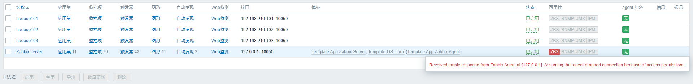
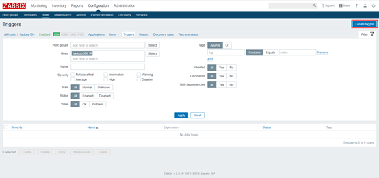
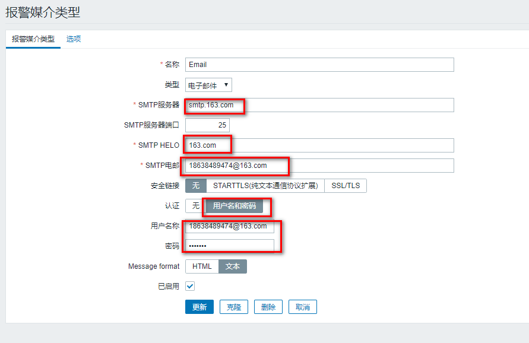

# Zabbix术语

## Host（主机）
一台你想监控的网络设备，用IP或域名表示。

## Item（监控项）
你想要接收的主机的特定数据，一个度量数据。

## Trigger（触发器）
一个被用于定义问题阈值和“评估”监控项接收到的数据的逻辑表达式。

## Action（动作）
一个对事件做出反应的预定义的操作，比如邮件通知。

# Zabbix使用测试

## web切换中文


## 创建Host
1）点击Configuration/Hosts/Create host


2）配置Host


添加3个


默认的主机有报错是ip地址的原因，点击名称修改一下



过一会就好了：

## 创建Item
Item必须在host中配置

1）点击Items


2）点击Create item


3）配置Item

使用监控进程数的这个键值

```
name:进程的名称，user：用户，state：进程的状态，cmdline：启动进程的命令。
proc.num[<name>,<user>,<state>,<cmdline>]

# 我使用这个，启动datanode的命令包含datanode
proc.num[,,all,datanode]
```

看看启动datanode的命令
```sh
[hadoop@hadoop101 app-script]$ ps -ef | grep datanode
hadoop    12184      1 11 22:54 ?        00:00:04 /opt/module/jdk1.8.0_144/bin/java -Dproc_datanode -Xmx1000m -Djava.net.preferIPv4Stack=true -Dhadoop.log.dir=/opt/module/hadoop-2.7.2/logs -Dhadoop.log.file=hadoop.log -Dhadoop.home.dir=/opt/module/hadoop-2.7.2 -Dhadoop.id.str=hadoop -Dhadoop.root.logger=INFO,console -Djava.library.path=/opt/module/hadoop-2.7.2/lib/native -Dhadoop.policy.file=hadoop-policy.xml -Djava.net.preferIPv4Stack=true -Djava.net.preferIPv4Stack=true -Djava.net.preferIPv4Stack=true -Dhadoop.log.dir=/opt/module/hadoop-2.7.2/logs -Dhadoop.log.file=hadoop-hadoop-datanode-hadoop101.log -Dhadoop.home.dir=/opt/module/hadoop-2.7.2 -Dhadoop.id.str=hadoop -Dhadoop.root.logger=INFO,RFA -Djava.library.path=/opt/module/hadoop-2.7.2/lib/native -Dhadoop.policy.file=hadoop-policy.xml -Djava.net.preferIPv4Stack=true -server -Dhadoop.security.logger=ERROR,RFAS -Dhadoop.security.logger=ERROR,RFAS -Dhadoop.security.logger=ERROR,RFAS -Dhadoop.security.logger=INFO,RFAS org.apache.hadoop.hdfs.server.datanode.DataNode
hadoop    12418   1251  0 22:55 pts/2    00:00:00 grep datanode
```


4）查看创建的Item


5）查看Item最新数据


停止进程测试;
```
[hadoop@hadoop101 app-script]$ stop-dfs.sh 
```


## 创建Trigger

1）点击Conguration/Hosts/Triggers


2）点击Create Trigger



3）编辑Trigger


4）测试Trigger
关闭集群中的HDFS，会有如下效果


## 创建Action
1）点击Configuration/Actions/Create action


2）编辑Action


配置操作：


## 创建Media type
1）点击Administration/Media types/Email


这里是直接修改默认的，我们也可以添加自定义。

2）编辑Email



3）测试Email


4）Email绑定收件人


## 监控发邮件测试
配置完没法邮件是应为只有监控到从正常到不正常才会触发


启动dfs
```
[hadoop@hadoop101 app-script]$ start-dfs.sh
```

关闭dfs
```
[hadoop@hadoop101 app-script]$ stop-dfs.sh 
```

不知道为啥收件人配置qq邮箱没收到，又配置成163收到了


# 模板使用测试
一个一个host配置太过麻烦，实际中都是使用模板。

## 创建模板


配置监控项


配置触发器


## 应用模板


## 配置模板的动作


## 测试
启动dfs
```
[hadoop@hadoop101 app-script]$ start-dfs.sh
```

关闭dfs
```
[hadoop@hadoop101 app-script]$ stop-dfs.sh 
```

3个邮件都发出去了。1是单独定义的，2、3是用的一个模本，实际中记得都使用模板。


```

```